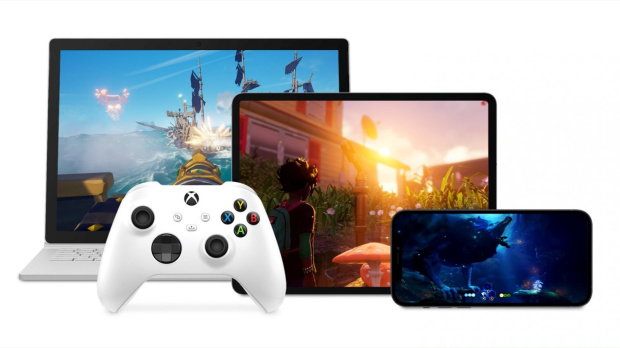

# Module Info

module info: http://modules.bolton.ac.uk/GAP5005

## Description
This module equips the student with the knowledge, understanding and skills to work with non-PC games hardware and peripherals. Working with modern gaming hardware you will learn how to handle a variety of different situations that may include:
- limited device resources (such as memory, battery life and CPU speeds)
- unstable network connections
- debugging the code you create from PC to device/console

You will use different development setups such as alternate Integrated Development Environments (IDEs), simulated platform environments and cross platform code. Different methods of input handling (touch screen, motion control, control pads) will be demonstrated and then worked on in a practical manner in the lab sessions. This module also provides you with information on the different ways to prepare your games for market, including the code and functional restrictions put in place by platform holders and how digital downloads have changed both the environmental and social impact of gaming. The following GAME attributes are developed in this module: Global Citizen, Adaptable and Lifelong Learner.

### Indicative Content
- Hardware Features
- Development Tools (IDEs etc)
- Hardware Capabilities and Constraints
- Debugging on Devices
- Input Handling
- Portable Hardware
- Different Hardware Architectures (Multi-Core, ARM)

### Learning Outcomes
On successful completion of this Module you will be able to:
1. Produce software that runs on non-PC hardware.
2. Identify and apply key aspects of different APIs or libraries
3. Demonstrate effective skill using development tools for dedicated hardware
4. Analyze the main architectural and functional features of specific games hardware

