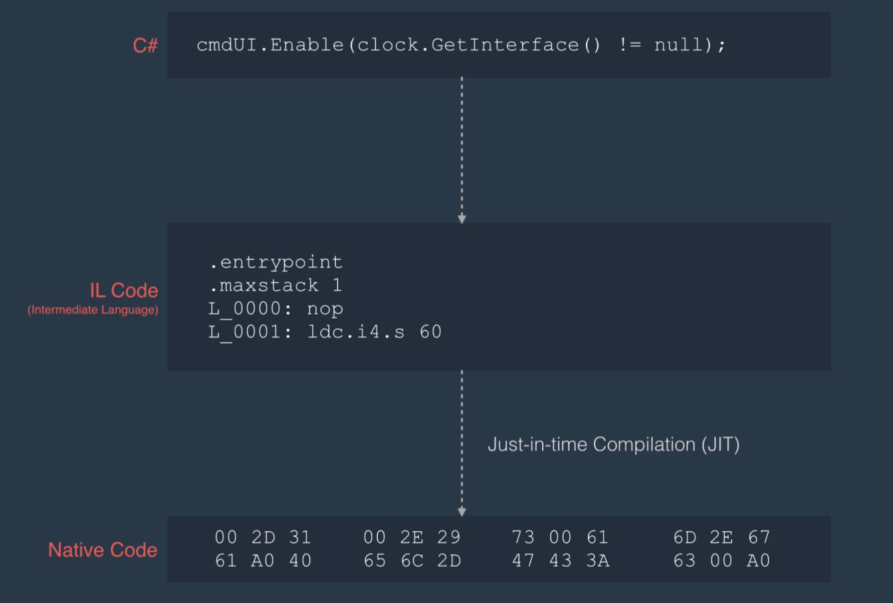
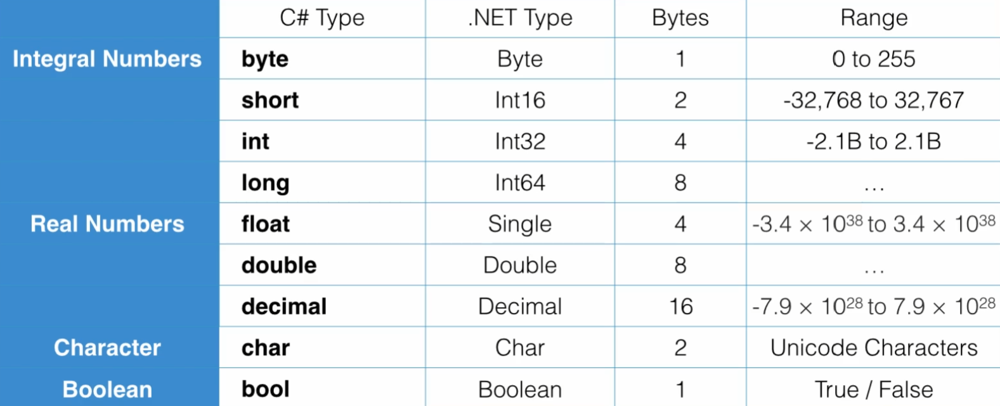

import NET_CLASSES from './img/netclasses.png';
import NAMESPACE from './img/namespace.png';
import ASSEMBLY from './img/assembly.png';
import APP from './img/app.png';
import ARITHMETIC_OPERATORS from './img/arith.png';
import ARITHMETIC_OPERATORS_2 from './img/arith1.png';
import COMPAR from './img/compar.png';
import ASSIGNMENT_OPERATORS from './img/assign_operators.png';
import LOGICAL_OPERATORS from './img/logical_operators.png';
import BITWISE_OPERATORS from './img/bitwise_operators.png';
import CLASS from './img/class.png';
import STATIC_MODIFIER from './img/static_modifier.png';
import STATIC_MODIFIER2 from './img/static_modifier2.png';
import ESCAPE_CHARACTERS from './img/escape_characters.png';
import REF_VAL from './img/refval.png';
import CONTROL_STRUCTURES from './img/control_structures.png';
import MULTI_DIMENSION_ARRAYS from './img/mda.png';
import JAGGED from './img/jagged.png';
import ARRAY_TYPE from './img/array.png';

# C# Basics Part 1
In this tutorial we will learn the basics of C#. This is very high quality tutorial, a comprehensive and deep understanding of C# will be obtained by the end of this 3 part tutorial pages.

## C# vs. .NET Framework
- C# is a programming language (statically typed and object-oriented)
- .NET is a framework for building applications on Windows

## .NET Framework
.NET Framework consist of the following two components:
- CLR (Common Language Runtime)
- Class Library

## CLR (Common Language Runtime)

For languages like `c/c++` when we compile the application, the **compiler** translates our code and we get a native machine code. Which means if we write an application in `c++` on Windows machine   with 86x processor architecture, the compiler would translate our code into the native code for that machine. But, we have different hardwares, different operating systems, so if we take that application (compiled program) into a computer with a different operating system and CPU architecture, that would not run. 


So when **Microsoft** was designing the C# language, and the .NET framework, came with an idea that borrowed from Java language, in Java when you compile a program it translates to intermediate language called **ByteCode** and we have the same exact concept in C#.



When we compile a C# application we get a **IL** Code (Intermediate Language) is independent from the computer its running on, then we have something that translate that IL intermediate code into the native machine code. That is the job of then **CLR**, it is an application that sitting in the memory whose job is to translate the IL code into the machine code. This process is called **Just-in-time Compilation (JIT)**. With this architecture, you can write an application in C# and don't have to worry about compiling that into the native code for different machines, as long as the machine has **CLR** that can run your application.


## Architecture of .NET Applications

Let us learn now about the architecture of .NET applications, at a very high level, when you build an application with C#, your application consist of building blocks called **classes**. These classes collaborate with each other at runtime, and as a result the application provides some functionality. 

<div class="image-container">

</div>


A **class** contains some data (attributes/fields) and some functions (methods/behaviours), data represent the <u>state</u> of the application.


Now as the number of classes grows, we need a way to organize these classes, that is where we use a **Namespace**.  A Namespace, is a container for related classes. For example, in the .NET framework, we have namespaces containing tens of related classes, we have namespaces for working with data like databases, we have namespaces for working with graphics and images, we have namespaces for working with security. 

<div class="image-container">

</div>

Now, in real world applications, as these namespaces grow, we need a different way of partitioning an application and that when we use an **Assembly**. An Assembly, is a container for related namespaces, physically it is a **file** on the disk, which can either be a an **executable (EXE)** or a **DLL (Dynamically Linked Library)**. 


<div class="image-container">

</div>

When you compile your application, the compiler, builds one or more assemblies depending on how you partitioned your code.

<div class="image-container">

</div>


## Primitive Types and Expressions
This section will explore the concepts of  **Variables and Constants**, **Data Types**, **Type Conversion and Overflowing**, **Scope**, **Operators** and **Comments**.

### Variables and Constants
- **Variable** is a name given to a storage location in memory
- **Constant** is an immutable value

```csharp
// General Syntax : <const> <data-type> <identifier> = <value>;

// Declaring Variables and Constants
int number;

// Initialize Variables
int Number = 1;

const float Pi = 3.14f;
```

:::warning 

Note: that **C#** is a case-sensitive language, meaning these two identifiers **number** and **Number** are different. Also variables **must** be <u>initialized</u> before usage, otherwise you get a compile-time error.

:::

#### Identifiers
- Cannot start with a number
- Cannot include a whitespace
- Cannot be a reserved keyword
- Use meaningful names.


#### Naming Conventions
Some popular variable naming conventions.

- Camel Case          : `firstName`
- Pascal Case         : `FirstName`
- Hungarian Notation  : `strFirstName`
- Snake Case          : `variable_one`

Its usually preferred to use camel case, and avoid hungarian notation.




##### Real Numbers

`double` is the default type for floating-point decimal numbers.

```csharp
float   number = 1.2f; // To tell the compiler to treat the number as a float otherwise it would be double
decimal number = 1.2m; 
```


To learn more you can google search:
- C# built-in types
- http://msdn.microsoft.com/en-us/library/cs7y5x0x(v=vs.90).aspx


### Overflowing

Now we talk about the concept of **overflowing**. Consider the following code snippet.

```csharp
byte number = 255;

number = number + 1; // 0
```

`255` is the largest value we can store in a byte. In the second line we are trying to increment number one to have 256. But if you compile and run your application you will see `zero (0)`. This is what we call overflowing. We have exceeded the boundary of the byte data type. In C# by default we don't have overflowing checking, which means we can modify the value of a variable at runtime and if we go beyond the boundary of its underlying data type, we will get overflow. Sometimes this is not desirable in our application and want to stop overflowing, if that is the case we need to use the `checked` keyword.

```csharp
checked 
{
  byte number = 255;

  number = number + 1; 
}
```
With this code, overflow will not happen at **runtime**, instead an exception will be thrown and the program will crash unless you handle the exception. We will cover exception now, but much later in part 3 of the C# tutorial. In reality this is rarely happens, since if we are concerned about overflow, we simply use a bigger data type such as `short` in this example. There is also the case when the result is smaller than the smallest value that can be stored or represented, these are often called **underflows**.

### Scope
- Where a variable / constant has meaning. Take a look at the following code snippet.

```csharp
{
  byte a = 1;
  {
    byte b = 2;
    {
      byte c = 3;
    }
  }
}
```
A **block** is indicated by a pair of curly braces `{}`.  Here we have three blocks of code, the variable `a` is accessible in that block or any child blocks, if you try to access the variable `a` outside of the first block, the program will not compile. The same rule applies to the other variables `b` and `c`. `b` is meaningful in its scope block and any of its children blocks. 


### Type Conversions
We will be taking about various kinds of type conversion.

- Implicit type conversion
- Explicit type conversion (Casting)
- Conversion between non-compatible types

:::info

#### Implicit Type Conversion

```csharp
byte b = 1;       //                            000000001
int i = b;        // 00000000 00000000 00000000 00000001
```

A `byte` takes only one byte of memory and an `int` takes four bytes of memory. So we can easily copy a byte into an integer. As can be shown from the <u>binary representation</u>, there is no data lose, when the compiler is sure that the data types are compatible and no data loss will happen, values can be converted to a different type `implicitly`.

An example of something that won't compile:

```csharp
int i = 1;
byte b = i; //  won't compile
```

In this example, we declared an integer and we are trying to copy that to a byte, an integer is four bytes, so when we convert that to a byte, three bytes out of four bytes will be gone, and there is a chance for data loss, now `data loss` doesn't always happen, it only happens if the value we stored in the integer is beyond the capacity of a byte, in this example `one` can be stored in a byte, so no data loss will happen, but if we had `300` here, we cannot store `300` in a byte and as a result of that conversion data will be lost. When the compiler knows there is a chance for data loss, it doesn't allow `implicit type conversion` and you need to explicitly tell the compiler that you are aware of the data loss and you still want to go ahead with the conversion.


:::


:::info

#### Explicit Type Conversion

```csharp
int i = 1;
byte b = (byte) i;
```

This is the same as the last example, the only difference is we have prefixed `(byte)` before assigning the value of `i` into `b`. Which means we are trying to convert `i` into a byte. This is called as `casting`.

```csharp
float f = 1.0f;
int i = (int)f;
```

Here is another example, casting tells the compiler I am aware of the data loss and still wants to convert `f` which is a float into an integer.
:::

:::info 

#### Non-compatible types

Sometimes we have non-compatible types but still need to convert between them.

```csharp
string s = "1";
int i = (int)s; // won't compile
```
In this example and similar examples, is where we have a number represented as a string, and we need to convert it to an integer. Since in this situation string and integer are not compatible, we cannot use explicit casting.  

```csharp
string s  = "1";
int i     = Convert.ToInt32(s); // Method 1
int j     = int.Parse(s);       // Method 2
```

`Convert` class is part of the .NET framework, and is defined in Systems namespace. Contains different methods for conversion and they all start with `To...`. The second method is `Parse`, all primitive types have this `Parse` method, and the parse method takes in a string and tried to convert that to the target type. 

The following are some of the methods you can use and find in the `Convert` class:

```csharp
Convert.ToByte  (s);
Convert.ToInt16 (s);
Convert.ToInt32 (s);
Convert.ToInt64 (s);
```


:::

Sample C# Program using type conversion.

```csharp

using System; // Namespace System

namespace TypeConversion
{
  class Program
  {
    static void Main(string[] args)
    {
      try
      {
        string str = "true";
        bool a = Convert.ToBoolean(str);
        Console.WriteLine(a);

        // The try-catch for this case.
        var number = "1234";
        byte b = Convert.ToByte(number);
        Console.WriteLine(b);
      }
      catch(Exception)
      {
        Console.WriteLine("The number could not be converted to a byte.");
      }
    }
  }
}


```

### Operators

In C# we have the following five types of operators:

- Arithmetic Operators
- Comparison Operators
- Assignment Operators
- Logical Operators
- Bitwise Operators


#### Arithmetic Operators
In computation, when we are working with numbers.

<div class="image-container">

</div>

We also have two arithmetic operators called `increment` and `decrement`.

<div class="image-container">

</div>

Which are shortcuts for adding or subtracting one. Note, with this increment and decrement operators, there are two ways in which you can apply them. `Postfix Increment` and `Prefix Increment`. 

```csharp
// Postfix Increment
int a = 1;
int b = a++; // b = 1, a = 2;
```

```csharp
// Prefix Increment
int a = 1;
int b = ++a; // b = 2, a = 2;
```

#### Comparison Operators
Comparing values, can be accomplished using comparison operators.

<div class="image-container">

</div>

Note the difference between the assignment operator `=` and the equality check `==`.

#### Assignment Operators

<div class="image-container">

</div>

#### Logical Operators
Logical operators are used in **boolean expressions** which are often used in conditional statements.

<div class="image-container">

</div>

#### Bitwise Operators
These are often used in low-level programming. For example, when working with `Win32` api or sockets or encryption. 

<div class="image-container">

</div>

### Boolean Algebra
Logical operators are part of Boolean algebra, the value of variables can only be **true** or **false**, also denoted 1 or 0 respectively. Unlike elementary algebra, where the main operations are addition, subtraction, etc, the main operations of Boolean Algebra are **conjunction** (AND), **disjunction** (OR) and **negation** (NOT).

#### Logical AND
Let’s assume we have two variables: **x** and **y**. In C#, the logical AND operator is indicated by &&. We can define a Boolean expression as follows:

`z = x && y`

In this expression, **z** is true if both **x** and **y** are true; otherwise, it’ll be false.

What is a real-world example of this in programming? Imagine you’re developing a loan application. The provider only offers loans to applicants who are over 18 and are citizen of the given country. In this example, we have two variables:

```
x = applicant being over 18
y = application being a citizen
z = is eligible to apply for loan = x && y
```

If both **x** and **y** are true, the applicant is eligible to apply for a loan. Later, when we get to conditional statements, you can check to see if the above expression evaluates to true or false, and then, can change the flow of your application. 

So, here is the rule of thumb with logical AND: if both **x** and **y** are true, **x && y** will be true; otherwise, it’ll be false

#### Logical OR
In C#, logical OR is indicated by two vertical lines (||). Considering the following expression:

`z = x || y`

**z** will be true, if either **x** or **y** is true.

What is a real-world example of this? Imagine you're building software for a recruiter. For a given job application, applicants can apply if they have a degree in computing, or more than 5 years of experience in the field. You can model this using a Boolean expression as follows:

```
x = applicant has a degree in computing
y = applicant has more than 5 years of experience

z = application is eligible = x || y
```

If either x or y is true, z will be true.

So, unlike the logical AND, where both variables must be true, with logical OR, if at least one of them is true, the result will be true.


#### Logical NOT
The NOT operator in C# is indicated by an exclamation mark (!) and it reverse or flip the value of a given variable or expression.

`y = !x`

so, here, if **x** is true, **y** will be false,  and if **x** is false, **y** will be true.

:::tip

## Clean Coding

In all examples, here, I used variables **x** and **y**, mainly to relate programming to Boolean algebra. But when it comes to coding, you should avoid using variable names such as x, y, z as they don't give a clue to other developers reading your code (or even yourself). Instead, use meaningful names. For instance, in the first example, you can replace **x**, **y**, and **z** as follows:

```
x : isOver18
y : isCitizen
z : isEligible
```

often, it's a good practice to prefix Boolean names with IS or HAS (if possible).


:::


### Comments
A text we put into our code to improve its readability and maintainability. In C# we have two ways to write comments. 


#### Single-line Comment
```csharp
// Here is a single-line comment
int a = 1;
```
#### Multi-line Comments
```csharp
/*
  Here is a multi-line
  comment
*/
int a = 1;
```

#### When to use
To explain whys, hows, constrains, etc. not the whats. Keep your comments to a minimum, use only when required. Do not explain what the code is doing, your code should be so clean and straight forward, that it does not need comments.  If the comment is just explaining what the code is doing, then its redundant and the problem with redundant comments is we change the code but not everyone is very consistent in changing the comments, so after a while the comments become out-dated and there is no way to validate them and after a while they become useless.


## Non-Primitive Types

In this section we will be taking about the non-primitive data structures of C#. Such as **Classes**, **Structures**,  **Arrays**, **Strings** and **Enums**.  Then will discuss important topics of `reference types vs value types` which are about memory management of different types in C# language.


### Classes
Classes are the building blocks of our applications. Class combines related variables (fields) amd functions (methods). 

<div class="image-container">

</div>

A class is a `type` or a `blueprint` from which we create **objects**. An object is an **instance** of a class. When you run your applications, its the objects that talk to each other and collaborating to provide some functionality.

To create a class in C# we start with an **access modifier** then the class keyword and an Identifier.

```csharp
public class Person
{
  public string Name;

  public void Introduce()
  {
    Console.WriteLine("Hi, my name is " + Name);
  }
}
```
Public makes the class accessible from anywhere in your application. We declare the variables inside the class scope block, they are called fields and also require access modifier. We can also define methods, in this case we have a method that does not return anything and that takes no arguments. It just outputs the name of the person on the console.

Here is another example:
```csharp
public class Calculator
{
  public int Add(int a, int b)
  {
    return a + b;
  }
}
```
A calculator class with one method that takes two integers and return an integer.

#### Creating Objects
Creating objects, or instances of classes, we need to allocate memory for the new object. They are treated different than primitive types. But unlike other languages like `c` or `c++`, you don't have to worry about `deallocating` that memory. CLR (Common Language Runtime) will take care of that for you, it has a process called **garbage collection** which automatically removes all objects that are not used. 

```csharp
Person person = new Person();
```

To allocate memory to a new object on the heap, we use the **new** operator and repeat the type of the class and parenthesis.  We can use this code shorter by using the **var** keyword, which let the compiler determine the type of the variable at compile-time, you can thing of `var` similar to the `auto` in C++.

```csharp
var person = new Person();

// Access object members
person.Name = "Mohammed";
person.Introduce();
```

#### Static Modifier

```csharp
public class Calculator
{
  public static int Add(int a, int b)
  {
    return a + b;
  }
}
```

We have added the `static` keyword to the `Add(...)` method and as a result we can access this method directly from the class without creating an instance or object. the Add() method is a static member, and we can't access static members from objects.

```csharp
int result = Calculator.Add(1,2);
```

<div class="image-container">

</div>

Without static modifier, when we create let say three objects of the type Calculator class, each object in the member will have the add method.  But when you apply the static modifier, that method will be in only one place in memory. And that is the calculator class itself. So it will not be repeated three times in memory.


<div class="image-container">

</div>

Why do we need this, we use the static modifier when we represent a concept that a single instance of that should exist in memory.  For example, the program **entry point** main function, is static. Which means there is only one instance of the main method in memory, there is only one entry point in C#. 

```csharp
class Program
{
  static void Main()
  {
  }
}
```

### Structs
C# has something similar to classes called `struct` for structure. Which is a bundle of data, you can think of it a memory region. 

```csharp
public struct RgbColor
{
  public int Red;
  public int Green;
  public int Blue;
}
```

Combine related fields and methods together, although its similar to classes but has distinct differences. Use a structure when you want to define a small lightweight object. E.g. rgb color, a point. Its more efficient for having multiple small objects, like 1000 points or colors.


### Arrays
Another non-primitive type we have in C# is array. The following section will introduce the basics of arrays in C#, later we will go more in depth. 

**Array** A data structure to store a collection of variables of the same type.

#### Declaring Arrays

```csharp
int number1;
int number2;
int number3;

int[] numbers = new int[3];
```
Imagine you want to work with three numbers, instead of having three different variables, you can define a variable array that can work with three numbers. You need to allocate memory and is an object behind the scene, the compiler creates an instance of the Array class.

#### Accessing Array Elements

```csharp
int[] numbers = new int[3];

numbers[0] = 1;
numbers[1] = 2;
numbers[2] = 3;

```

Note in C# arrays are `zero-indexed` which means the first element in the array start at index 0. 

```csharp
// If you know the values before hand you can use the object initializer list and make the code shorter
int[] numbers = new int[3] {1,2,3};
```

### Strings

In this section will explore the following topics, later on, we will learn more about strings:

- What is a string
- How to create strings
- Escape characters and verbatim strings

**string** is a sequence of characters. e.g. `"Hello World"`.

#### Creating Strings
There are many ways to create strings in C#.

Using String Literals.

```csharp
string firstName = "Mohammed";
string lastName = "Fajer";
```
Using String Concatenation.

```csharp
string name = firstName + " " + lastName;
```
Sometimes it can be hard if you are using string concatenation to determine what is what, so there is another way to concatenate strings that can be more suitable in certain sitatuins.

Using String Formats
```csharp
string name = string.Format("{0} {1}", firstName, lastName);
```
`Format(...)` is a static method of the string class.

Using String Join
```csharp
var numbers = new int[3] {1,2,3};
string list = string.Join(",", numbers); // 1,2,3
```
Calling `Join(...)` static method of the string class passing the separator and the list of numbers to combine.

#### String Elements

```csharp
string name = "Mohammed";
char firstChar = name[0];

name[0] = 'm'; // will not be compiled. not allowed as strings are immutable.

```

#### Strings are Immutable
- Once you create them, you cannot change them.


#### Escape Characters

<div class="image-container">

</div>

There are special characters that have different meanings. Escaping special characters using `\`. 

#### Verbatim Strings

```cs
string path = "c:\\projects\\project1\\folder1"; // Looks messy

// Verbatim Strings
string newPath = @"c:\projects\project1\folder1";
```

### Enums

Another type is Enum, it is a data type that represent a set of name/value pairs (constants). 

Example: Imagine you are building an application for post company and want to support few different shipping methods.

One way you can declare a few constants

```csharp
const int RegularAirMail = 1;
const int RegisteredAirMail = 2;
const int Express = 3;
```

each representing a shipping method, and in your application based on the shipping method, you can make decisions to calculate the shipping cost, or the tax or display different messages to the user, so possibilities are endless. Even though this approach works, its a little bit messy. It is better to define a new type, where we can represent different shipping methods so that where we use an **Enum**.

```csharp
public enum ShippingMethod
{
  RegularAirMail = 1,
  RegisteredAirMail = 2,
  Express = 3
}
```
Use `enums` where you have a number of related constants. Instead of declaring multiple constants, declare an enum, this will be a new type in our applications, just like classes or structures. We can use enum with the `.` dot notation.

```csharp
var method = ShippingMethod.Express;
```
Note: enum internally is an integer but if you have a reason to change that, then you can specify that type during declaration  of your enum.

```csharp
public enum ShippingMethod : byte
{
  RegularAirMail = 1,
  RegisteredAirMail = 2,
  Express = 3
}
```

Example Program Using Enum.

```csharp
using System;

namespace CSharpFundamentals
{
  // by default set to zero, and the next are incremented by one
  public enum ShippingMethod
  {
    RegularAirMail = 1, 
    RegisteredAirMail = 2,
    Express = 3
  }

  class Program
  {
    static void Main(string[] args)
    {
      // Using Integers
      var method = ShippingMethod.Express;
      Console.WriteLine((int)method); // Casting 

      var methodId = 3;
      Console.WriteLine((ShippingMethod)methodId); // Express

      // Using strings
      Console.WriteLine(method.ToString()); // Express
      Console.WriteLine(method); // Console.WriteLine calls method ToString method.

      var methodName = "Express";
      ShippingMethod shippingMethod = (ShippingMethod) Enum.Parse(typeof(ShippingMethod), methodName);
    }
  }
}

```


### Reference Types and Value Types
In C# we have two main types in which we create new types. We have `classes` and `structures`. All primitive types are structures, custom structures. Arrays, Strings are classes, custom classes. They are treated differently at runtime in terms of memory management.


<div class="image-container">

</div>

  Structures are what we call **value types** and classes are **reference types**. Value types are allocated on the stack memory section at compile time. This memory allocation done automatically, immediately removed when out of scope by runtime or CLR. With reference types, the programmer is responsible for allocation at runtime, memory is allocated on the heap section of memory, through the process of garbage collection by runtime or CLR, all unused object and reference types get cleaned after some time by this process.


#### Copying Value Types
```csharp
using System;

namespace CSharpFundamentals
{
  public struct Coords 
  {
    public int X;
    public int Y;

    public Coords(int x, int y)
    {
      X = x;
      Y = y;
    }

    public override string ToString() => $"({X}, {Y})";
  }

  class Program
  {
    static void Main(string[] args)
    {
      var a = new Coords(1,2);
      var b = a;
      b.X = 66;
      Console.WriteLine(a); // (1, 2)
      Console.WriteLine(b); // (66, 2)
    }
  }
}

```

As you can see from the above example, since structure is a value type, a was copied into b. This is known as a value type assignment, where the values of the fields in `a` are copied to the corresponding fields in `b`. This behavior is due to the fact we are using value types in C#. Value types hold their data directly and are stored on the stack, example include, primitive types (int, float, etc.) and structs. Another important note is the use of `new` keyword with structures, even though we have used the `new` keyword when creating instances of the `Coords` structure, structs are still value types. The `new` keyword is used to call the constructor of a struct, but the memory allocation and management behavior for structs remains that of value types (stack allocation).


## Control Flow
In this section will explore conditional and iteration statements in C#. We use these statements to control the `flow` of the program.

<div class="image-container">

</div>


### Conditional Statements

We will take a look at C# language constructs that are used for controlling the program execution. The following constructs will be explored:

- If / else statements
- Switch / case statements
- Conditional operator : A ? B : C


#### If / else
A basic structure looks something like:
```cs
if(condition)
  someStatement

else if(anotherCondition)
  anotherStatement

else
  yetAnotherStatement
``` 
The statements in the `if` and `else if` are only executed if the conditions are true in that case. The `else` is executed if none of the conditions before were true. 

If we have one or more than one line of code we need to enclose them with curly braces:

```cs
if(condition)
{
  someStatements
}
else
{
  otherStatements
}
```

Another thing, we can do is `nest` if statements together called nested-if statements.

```cs
if(condition)
{
  if(anotherCondition)
    ...
  else
    ...
}
```
Generally, its a bad practice to use multiple nested if statements as it result in code that is hard to read, hard to understand, hard to maintain and hard to test, that is what we call a **code smell** and that is something you should avoid at all times.


#### Switch / case 
Switch is slightly different than if, `if statements` we usually have a condition that is evaluated and if its true, some piece of code will be executed, With switch however, we have a variable that we compare its value with different values. 


```cs
switch(role)
{
  case Role.Admin:
    ...
    break;
  case Role.Moderator:
    ...
    break;
  default:
    ...
    break;
}
```

:::note
Each `case` statement is terminated by **break** statement. If none of the cases is true, then the default block/case is executed. 
:::


### Iteration Statements
Iteration statements are used for repeatedly executing a sequence of statements. In C# there is four iteration statements:
- For loops
- Foreach loops
- While loops
- Do-While loops

Let us now examine the syntax of each iteration construct.

#### For Loops
For loops has three parts `<initialization clause> ; <condition clause> ; <iteration clause (increment/decrement) counter variable>`.
```cs
for(var i = 0; i < 10; i++)
{
  ...
}
```

#### Foreach Loops
Foreach is used to iterate over elements of an enumerable object. What does `enumerable` means ?  in plain language, anything that has some kind of list or array nature. For example, strings are a sequence of characters, so strings are enumerable, the array type also enumerable. We can do that with for loop but with foreach is easier and cleaner. The syntax `<local variable> in <list or object we are iterating>`.

```cs
int[] numbers = new int[3] {1,2,3};
foreach (var number in numbers)
{
  ...
}
```

#### While Loops

In C# we also have while loops.

:::note
The syntax looks something like:
```
<initialization clause>
while (<condition clause>)
{
  ...
  <iteration clause (increment/decrement) to get closer to condition>
}
```
:::


```cs
while(i < 10)
{
  ...
  i++;
}
```

As long as the condition is valid, the loop will execute.

#### Do-While Loops

Finally we have the do-while loop. This is exactly similar to the while loop with one key difference, the loop body is guaranteed to execute at least once because the condition is evaluated at the end of the while loop.

```cs
do
{
  ...
  i++;
} while (i < 10);
```


#### Break and Continue

- `Break` jumps out of the loop.
- `Continue` jumps to the next iteration.


## Arrays and Lists
At this point you know a little bit about arrays, in this section we will expand our knowledge about arrays and introduce you to multi-dimensional arrays. This is useful when working with structures such as `Matrix`. We are also going to introduce a `generic list` which are very useful in building real-world applications.

### Arrays
In this section we will cover the following:
- Quick review of arrays
- Types of Arrays in C#
- Array methods

**Array** represent a fixed number of variables of a particular type. 

#### Types of Arrays
In C# there are two types of arrays `single dimension` and `multi dimension`.

```cs
var numbers = new int[5];

// Object Initialization Syntax
var numbers = new int[5] {1,2,3,4,5}; // If we know ahead of time the values we want to store.
```

#### Multi Dimension Arrays

We have two types of multi-dim arrays in C#. `Rectangular` and `Jagged` arrays. In `Jagged` arrays the number of columns in each row can be different. A different way to look at `Jagged` arrays as array of arrays. In `.NET` CLR is optimized around single dimensional arrays. 


<div class="image-container">

</div>


#### Syntax (Rectangular Array 2D)

```cs
var matrix = new int[3, 5]; // 3 rows and each row has 5 columns
```

If we know the values we would like to store into this array ahead of time, we can initialize this array using object initialization list as follows:

```cs
var matrix = new int[3,5]
{
  {1,2,3,4,5},
  {6,7,8,9,10},
  {11,12,13,14,15}
};
```

To access an element in this array, we use index bracket:
```cs
var element = matrix[0,0];
```

#### Syntax (Rectangular Array 3D)

```cs
var colors = new int [3, 5, 4]; // 3x5x4
```

#### Syntax (Jagged)

To create the following Jagged array:


<div class="image-container">

</div>

```cs
var array = new int[3][];

array [0] = new int [4];
array [1] = new int [5];
array [2] = new int [3];

// To access an element in that array
array[0][0] = 1;
```

In `C#` all arrays map to the `Array` type that is defined in the `System` namespace of `.NET Framework`. The array type is a class, it has a bunch of `properties` and methods as shown in the image below.

<div class="image-container">

</div>

Example Code:

```cs
using System;

public class Program
{
  public static void Main(string[] args)
  {
    var numbers = new[] {3, 7, 9, 2, 14, 6};

    // Length Property
    Console.WriteLine("Length : " + numbers.Length);

    // IndexOf() method
    var index = Array.IndexOf(numbers, 9);
    Console.WriteLine("Index of 9: " + index);

    // Clear() method
    Array.Clear(numbers, 0, 2);

    Console.WriteLine("Effect of Clear()"); // The first two elements are set to zero.s
    foreach(var n in numbers) 
    {
      Console.WriteLine(n);
    }

    // Copy() method
    var anotherArray = new int[3];
    Array.Copy(numbers, anotherArray, 3); // Copy the first 3 elements from array to anotherArray

    Console.WriteLine("Effect of Copy()"); // 0 0 9
    foreach(var n in anotherArray) 
      Console.WriteLine(n);

    // Sort() method
    Array.Sort(numbers);
    Console.WriteLine("Effect of Sort()"); // 0 0 2 6 9 14
    foreach(var n in numbers) 
      Console.WriteLine(n);

    // Reverse() method
    Array.Reverse(numbers);
    Console.WriteLine("Effect of Reverse()"); // 14 9 6 2 0 0
    foreach(var n in numbers) 
      Console.WriteLine(n);
  }
}
```

### Lists
`List` in C# is a dynamic array. Up until now we had arrays for working with fixed number of objects. In some cases you are not sure how many of those objects you are going to be working with and that where we use a `List`. 

#### Arrays vs Lists
- Array : `Fixed size`
- List  : `Dynamic size`


#### Creating a List
List is a generic type `<type>` and you have to specify generic parameters, we will explain generics in part 3 of this C# Basics Tutorial. 

```cs
var numbers = new List<int>();
```

If we know ahead of time some of the objects we would like to store in the list. We can initialize the list using object initialization syntax.

```cs
var numbers = new List<int> () {1, 2, 3, 4};
```

#### Useful Methods

- `Add()` 
- `AddRange()`
- `Remove()`
- `RemoveAt()`
- `IndexOf()`
- `LastIndexOf()`
- `Contains()`
- `Count`

```cs
using System.Collections.Generic;

public class Program
{
  public static void Main(string[] args)
  {
    var numbers =  new List<int> () { 1, 2, 3, 4 };
    numbers.Add(1);
    numbers.AddRange(new int[3] {5, 6, 7});

    foreach(var number in numbers)
      Console.WriteLine(number);
    
    Console.WriteLine();
    Console.WriteLine("Index of 1: " + numbers.IndexOf(1));
    Console.WriteLine("Last Index of 1: " + numbers.LastIndexOf(1));

    Console.WriteLine("Count: " + numbers.Count);

    for(var i = 0; i < numbers.Count; i++)
    {
      if(numbers[i] == 1)
        numbers.Remove(numbers[i]);
    }

    foreach(var number in numbers)
      Console.WriteLine(number);

    numbers.Clear();
    Console.WriteLine("Count : " + numbers.Count);
  } 
}
```


## Working with Dates

In this section will learn how to work with `dates` and `times` in C#. We will introduce two new types in .NET, **DateTime** and **TimeSpan**.

### DateTime

This is a structured defined in `System` namespace.

```cs
using System;

namespace CSharpFundamentals
{
  class Program
  {
    static void Main(string[] args)
    {
      var dateTime = new DateTime(2023, 8, 31); // Constructor has many overloads
      var now = DateTime.Now;
      var today =  DateTime.Today;

      Console.WriteLine("Hour : " + now.Hour);
      Console.WriteLine("Minute : " + now.Minute);

      // They are immutable, once created, can't change.

      // To Modify them, use Add(..).. methods.

      var tomorrow = now.AddDays(1); 
      var yesterday = now.AddDays(-1);

      // String Formatting 
      Console.WriteLine(now.ToLongDateString());
      Console.WriteLine(now.ToShortDateString());
      Console.WriteLine(now.ToLongTimeString());
      Console.WriteLine(now.ToShortTimeString());

      Console.WriteLine(now.ToString("yyyy-MM-dd HH:mm")); // You can pass format specifier to this method

    }
  }
}
```

To learn more about `DateTime`, you can google search :
- C# datetime format specifier 

### TimeSpan
This type represent a length of time. There are different ways to create a `TimeSpan` but simplest one is to use the `new` operator.


#### Creating TimeSpan Objects
```cs
using System;

using CSFundamentals;

class Program
{
  static void Main(string[] args)
  {
    // 1 hr, 2 mins, 3 seconds
    var timeSpan = new TimeSpan(1, 2, 3) ; // Has multiple overloads

    var timeSpan1 = new TimeSpan(1,0,0);
    var timeSpan2 = TimeSpan.FromHours(1);

    // DateTime - DateTime = TimeSpan Object
    var start = DateTime.Now;
    var end = DateTime.Now.AddMinutes(2);
    var duration = end - start; // TimeSpan 

    Console.WriteLine("Duration : " + duration); // 00:02::00.0010000
  }
} 
```

#### Reading TimeSpan Object Properties
```cs
using System;

using CSFundamentals;

class Program
{
  static void Main(string[] args)
  {
    // ...
    var timeSpan = new TimeSpan(1,2,3); // Also immutable

    // Properties
    Console.WriteLine("Minutes : " + timeSpan.Minutes);
    Console.WriteLine("Total Minutes : " + timeSpan.TotalMinutes); 

    // Add 
    Console.WriteLine("Add Example : " + timeSpan.Add(TimeSpan.FromMinutes(8)));
    Console.WriteLine("Subtract Example : " + timeSpan.Subtract(TimeSpan.FromMinutes(2)));

    // ToString
    Console.WriteLine("ToString :" + timeSpan.ToString());

    // Parse
    Console.WriteLine("Parse: " + TimeSpan.Parse("01:02:03")); // Automatically applies ToString on the TimeSpan Object
  }
} 
```


## Working with Text

### String

### StringBuilder

### Procedural Programming

**Procedural Programming** is a Programming paradigm based on procedure calls. By procedure, it means, `function`, `method`, `routine`, and `subroutine`.  A way to break large programs into small methods, or procedures, and organize functionality that way, to help manage the complexity of the program.

**Object-Oriented Programming** A programming paradigm based on objects and message passing.

## Working with Files
In this section will learn how to work with `files` and `directories` in C#. We will introduce few useful classes in .NET (File, FileInfo, Directory, DirectoryInfo and Path).


### Introduction to System.IO
We will take a look on how to work with files and directories in C#. Under the namespace `System.IO` we have the following classes:
- `File`, `FileInfo`
- `Directory`, `DirectoryInfo`
- `Path`

There are many more classes in `.NET`, no one in the world, knows everything single class in `.NET`, you will discover classes based on your needs.

#### File, FileInfo

Provide methods for creating, copying, deleting, moving, and opening of files. They have similar interfaces, the only difference is:
- **FileInfo**: provides **instance** methods
- **File**: provides **static** methods.

For small operation it is more suitable to use static methods, but these are security checks done by the operating system, which implies that if you have large set of operations it is better and more efficient to create a FileInfo class instance and access all of its methods.

The following are possible methods:
- `Create()`
- `Copy()`
- `Delete()`
- `Exists()`
- `GetAttributes()`
- `Move()`
- `ReadAllText()`

#### Directory, DirectoryInfo
- **Directory**: provides **static** methods.
- **DirectoryInfo**: provides **instance** methods.

The following are possible mehtods:
- `CreateDirectory()`
- `Delete()`
- `Exists()`
- `GetCurrentDirectory()`
- `GetFiles()`
- `Move()`
- `GetLogicalDrives()`


#### Path
We also have the Path class. Contains methods that work with strings that contains path to file or directory information.

- `GetDirectoryName()`
- `GetFileName()`
- `GetExtension()`
- `GetTempPath()`


### Path
This class makes it really easy to work with strings that represent a path. Recommended to look at MSDN documentations so that you don't have to re-invent the wheel. 
```cs
using System;
using System.IO;

using CSharpFundamentals;

class Program
{
  static void Main(string[] args)
  {
    var path = @"C:\Projects\CSharpFundamentals\HelloWorld\HelloWorld.sln";
    
    // Low-level processing
    var dotIndex = path.IndexOf('.');
    var extension = path.Substring(dotIndex);

    // Using Path
    Console.WriteLine("Extension: " + Path.GetExtension(path)); // .sln
    Console.WriteLine("File Name: " + Path.GetFileName(path));  // HelloWorld.sln
    Console.WriteLine("File Name without Extension : " + Path.GetFileNameWithoutExtension(path)); // HelloWorld
    Console.WriteLine("Directory Name: " + Path.GetDirectoryName(path));  // C:\Projects\CSharpFundamentals\HelloWorld
  }
}
```

:::tip

 The same can be done with `File`, `FileInfo`, `Directory` and `DirectoryInfo` classes. Consult google search, or the MSDN website to have a look at their methods and how to use them.
:::

## Debugging Applications

### Debugging Tools in Visual Studio

### Removing Side Effects

### Defensive Programming

### Call Stack Window

### Locals and Autos Windows

