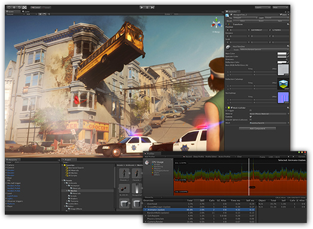

# Week 1 - Task Sheet 1 - Introduction to Unity

:::info

For the first week of the module we'll be introducing the Unity game engine. You will learn how to navigate the engine, create scripts, manage variables and implement basic game logic in order to produce a simple framework for future gameplay mechanics.

Unity uses the C# programming language, as its gameplay scripting language, so you will be learning a new language in this module, which I will teach you from the ground up.
:::

:::warning
**Note**: For this module, please ensure you are using one of the 2022 LTS (Long Term Support) builds of Unity.

The team at Unity are on a one-week development cycle. It's not rational for us to try to keep up with that, so we pick a version at the beginning of the module and stick with that.

:::

## Creating a Project
Before we go ahead and create our first Unity project, it's important to know for the entirety of this module we will be using Unity 2022.3. This is the version which is available on the University computers, and you must use this version if you are working remotely; failure to do so can result in corruption of loss of work. Please check the top of Moodle page for instruction on how to download the required Unity version outside of the University.

Open Unity, and you will be greeted with a screen which resembles the following:

## Engine Editor : Layout / Interface Design
here

## Creating Game Objects
here

## Scene / Object Navigation
here

## Hierarchy / Project / Inspector Panels
here

## Components
here

## Prefabs & Hierarchy Organization
here

## Snapping
here

## Camera
here

## Lighting
here

## Playing/Pausing the Game
here

## Saving Projects
here

## Importing Assets/Packages
here

