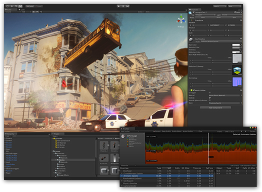

import UNITY_PROJ from './img/proj.png'
import UNITY_NEW_PROJECT from './img/new_project.png';
import UNITY_CREATE_PROJECT from './img/create_project.png';
import UNITY_EDITOR_LAYOUT from './img/layout.png';
import UNITY_SCENE_SELECTED from './img/scene_selected.png';
import UNITY_F_SELECT_OBJECT from './img/fselect_cube.png';
import UNITY_SCENE from './img/scene.png';
import UNITY_SCENE_NAV_TOOLS from './img/nav_tools.png';
import UNITY_HAND_TOOL from './img/hand_tool.png';
import UNITY_MOVE_TOOL from './img/move_tool.png';
import UNITY_ROTATE_TOOL from './img/rotate_tool.png';
import UNITY_SCALE_TOOL from './img/scale_tool.png';
import UNITY_RECT_TOOL from './img/rect_tool.png';
import UNITY_TRANSFORM_TOOL from './img/combination_tool.png';
import UNITY_CENTER_GLOBAL_TOOLS from './img/center_global.png';
import UNITY_HIERARCHY_PANEL from './img/hierarchy.png';
import UNITY_PROJECT_PANEL from './img/project.png';
import UNITY_PROJECT_PREFAB_FOLDER from './img/prefab_folder.png';
import UNITY_INSPECTOR_PANEL from './img/inspector.png';
import UNITY_CUBE_COMPONENTS from './img/components.png';
import UNITY_CUBE_TOGGLE from './img/toggle_mesh_renderer.png';
import UNITY_CUBE_PREFAB from './img/prefab.png';
import UNITY_CUBES from './img/12cubes.png';
import UNITY_PREFAB_VIEW from './img/prefab_view.png';
import UNITY_MULTIPLE_SELECT from './img/multiple_select.png';
import UNITY_EMPTY_GAME_OBJECT from './img/empty_gameobj.png';
import UNITY_ORGANIZE_HIERARCHY from './img/organize.png';
import UNITY_ORGANIZE_HIERARCHY2 from './img/hierarchy_organize.png';
import UNITY_SCENE_DISORGANIZED from './img/scene_disorganized.png';
import UNITY_SNAPPING_1 from './img/snapping_1.png';
import UNITY_SNAPPING_2 from './img/snapping_2.png';
import UNITY_SNAPPING_3 from './img/snapping_3.png';
import UNITY_SNAPPING_4 from './img/snapping_4.png';
import UNITY_SNAPPING_5 from './img/snapping_5.png';
import UNITY_SNAPPING_6 from './img/snapping_6.png';

import UNITY_CAM_1 from './img/camera_1.png';
import UNITY_CAM_2 from './img/camera_2.png';
import UNITY_CAM_3 from './img/camera_3.png';
import UNITY_CAM_4 from './img/camera_4.png';

import UNITY_POINT_LIGHT from './img/point_light.png';

import UNITY_PLAY_BUTTON from './img/play_button.png';
import UNITY_GAME_VIEW from './img/game_view.png';
import UNITY_GAME_VIEW_2 from './img/game_view_2.png';

import UNITY_PROJECT_FOLDERS from './img/project_folders.png';

# Task Sheet 1 - Introduction to Unity

:::info

For the first week of the module we'll be introducing the Unity game engine. You will learn how to navigate the engine, create scripts, manage variables and implement basic game logic in order to produce a simple framework for future gameplay mechanics.

Unity uses the C# programming language, as its gameplay scripting language, so you will be learning a new language in this module, which I will teach you from the ground up.
:::

:::warning
**Note**: For this module, please ensure you are using one of the 2022 LTS (Long Term Support) builds of Unity.

The team at Unity are on a one-week development cycle. It's not rational for us to try to keep up with that, so we pick a version at the beginning of the module and stick with that.

:::

## Creating a Project
Before we go ahead and create our first Unity project, it's important to know for the entirety of this module we will be using Unity `2022.3.8f1`. This is the version which is available on the University computers, and you must use this version if you are working remotely; failure to do so can result in corruption of loss of work. Please check the top of Moodle page for instruction on how to download the required Unity version outside of the University.

Open **Unity Hub**, and you will be greeted with a screen which resembles the following:

If it asks you to sign in, then create an account and register with a personal license, then the button you want to press is **New project**. You will see the following or (similar):

Go ahead and enter a suitable project name and set the location to be on your `C:` Drive, in the `Temp` folder.

:::info
The write speed is much faster here than it will be on a USB drive.
:::

Now you can ignore the **All Templates**. Once you are happy with your settings click the **Create project** button. Make sure to copy/take your work off the `C:` Drive at the end of the session.

## Engine Editor : Layout / Interface Design
As with any piece of software worth its salt, you can customize features to better suit your needs, and Unity is no different. Notice the numerous panels placed inside the software (`Hierarchy`, `Project`, `Console`, `Inspector`, `Scene`, `Game`); these windows can be placed where ever you like, but we'll go into what each of them are used for in **section 5.0**.

If yo don't fancy building your own interface by dragging the panels around, you can navigate to:

:::info
`Window -> Layouts -> Select from the list`
:::

Experiment with the layouts you like and you can always change them to suit your style. If you want to drag a panel, you can simply drag and drop it where you please, even if the destination is an undocked spot outside unity.

## Creating Game Objects
Now that we are happy with the layout, let us look at adding some objects into our game. A point which will be reiterated throughout this document is that the **Scene** view is where our game will be built, so when we add an object to our game, this is where we will view/manipulate it. Go ahead and make sure its selected:

With **Scene** selected, navigate to: **GameObject > 3D Object > Cube**.

Once you have selected **Cube** you will notice that it appears in your scene view. You can click the **F** key to get a closer look at your newly created object.

Go ahead and create some more shapes using the same method and get used to adding them to your scene. Once you have added several objects, you will notice that they are all stacking on top of each other, which is because when you create an object in the manner that we just did, the spawn position will always be the same `(0,0,0)`. Delete all your objects except for a single cube, and we will look at how to manipulate it.

## Scene / Object Navigation
Navigation is an important part of any complex software, and Unity has several tools in place which we can use to move around our scene. An important piece of information to note is that we can only use these tools to navigate around the **Scene** panel, which is selected/highlighted in red in the below image. This is the panel which we will use to build our environments.

The navigation tools in Unity can be found in the left section of the scene:

### Hand (View) Tool

The hand tool allows you to pan `left/right/up/down` across your screen to give you a better view of your game elements. You can use the **Q** shortcut key to select this tool. If you click the right button on your mouse you can then be able to pan across your screen.

### Move Tool

The move tool allows you to move physical game objects around the scene (change their position). This tool allows you to move along the `x`, `y` and `z` axis. You can use the **W** shortcut key to select this tool.

### Rotate Tool

The rotate tool allows you to rotate physical game objects. The tool allows you to rotate along the `x`, `y` and `z` axis. You can use the **E** shortcut key to select this tool.

### Scale Tool

The scale tool allow you to scale the `x`, `y` and `z` axis of physical game objects. You can use the **R** shortcut key to select this tool.

### Rect Tool

The rect tool is used to scale and rotate UI elements and is a feature you will likely not touch for several weeks; do not worry about it for now. You can use the **T** shortcut key to select this tool.

### Combination (Transform) Tool

This tool is a combination of the move, rotate, and scale tools. You will likely not use this very often, but if you are comfortable using it, then go ahead. You can use the **Y** shortcut key to select this tool.

### Center/Global

These two tools can be used to control how your pivot behaves and is especially beneficial if you have a custom model that you have imported with a custom pivot (imagine a door with a pivot on the hinge).

The **Center** box will make the pivot of the object central, whereas if you click the **Center** box it will change to **Pivot**, which is the object's local pivot (in our case it would be on the hinges).

The **Global** box will make your object move using world space, and not local space. Global space never changes, each axis is static. Local space changes depending on the object's orientation.

### Navigation Tips

:::tip

Sometimes it’s a little tedious to keep swapping back to the pan tool to get a better look at your scene, so instead of doing this, hold down the `alt key` and drag with your `left-mouse` button held down; you’ll notice that your navigation tools change, and revert back to what you were on previously. This is a very quick way to pan, and the sooner you get used to using this method the better. You can also use the `middle-mouse` button to pan in the same method. Give it a try!

Now that you’ve been exposed to the navigation tools, go ahead and manipulate your cube, and see how it behaves. Have a go at moving it around, rotating it, scaling it, and panning the camera around it for a better view. Make sure you are **VERY** comfortable with the controls before moving on to the next section.

:::

## Hierarchy / Project / Inspector Panels
Three of the **primary** panels which you will use inside of Unity are known as the **Hierarchy Panel**, the **Project Panel**, and **Inspector Panel**; each of them serves a bespoke purpose:

### Hierarchy Panel

All elements that you add to a **Scene** will appear here; the Hierarchy Panel is simply a list of objects placed within the scene / game.

### Project Panel

The **Project Panel** is used to store all your imports, scripts, scenes, animations, materials, and so on. You can create `new folders` in this panel by right-clicking, then clicking **Create > Folder**. So, for example, you might want to create a folder called **Scripts**, or a folder called **Models** for your imported models. You can name them whatever you like to aid organization. For now, create a new folder called **Prefabs**, which will explain and use a litter later.

### Inspector Panel

:::info
The **Inspector Panel** is arguably the most important of all the panels. 
:::

Go ahead and select your cube in the scene and take a look at the Inspector Panel (will be on the right if you used **Wide** layout).

Once you have selected the cube, you will see a number of what are known as **Components** attached to it, all of which are viewable via the Inspector Panel (we will explain these later). The first one, whilst not technically a component, is very important; notice the **Transform** section. You can see cube's position, its rotation, and its scale; have a go at changing these values in the Inspector Panel to see how it impacts your scene. Every object in your scene will have this **Transform** element attached to it. The Inspector Panel is used to add specific elements and values to specific game objects.

## Components

In the previous section we have looked at the Inspector Panel, and briefly touched on what it is used for. I mentioned **Components** which are the nuts and bolts of all objects in the games we create inside of Unity - they are the functional pieces of every **GameObject** (objects within the scene). Making sure your cube is selected in the **Scene** view, and take a look at the Inspector Panel to see what components are attached to it (ignore **Transform** and the shader at the bottom); this leaves us with:

The two **Components** which we are going to look at here are the **Mesh Renderer** and the **Box Collider**, both of which are somewhat self-explanatory.

### Mesh Renderer

This component takes information from the **Mesh Filter** component above it and uses it to render the object at the position specific to the **Transform** element/component. For now, I don't want you to worry about any of the settings attached to this component - I simply want you to toggle it off and on again by using the following tick box:

See how your cube reacts in your scene as you toggle it on and off. You will notice that it renders in and out, which is because the **Mesh Renderer** needs to be active for it to be able to render the object in our scene.

### Box Collider

Slightly easier to understand is the **Box Collider**, and it really does do what it says on the tin - it manges the object's collision; you can also make it a trigger, but we'll look at that in another lesson. For now, toggle it on and off like you did with the **Mesh Renderer** and notice how it simply disables the **Box Collider**. You also have access to the size of the collider in this **Component**, as well as how it is positioned relative to the cube. Have a play around with these settings to see how they behave. Once you're happy, make sure that **Center** is set to `0,0,0` and that **Size** is set to `1,1,1` (the default values).

### Adding / Removing Components

There are hundreds of components that we can add to a **GameObject** in Unity, but we don't want to overload ourselves with too much for now. So, for now, go ahead and remove the **Box Collider** component from the cube. To do this, you can simply right click the words **Box Collider** on the component and click **Remove Component**. Notice how the collider completely disappeared from our object in the scene. This is how you remove components.

Now, to add a component, make sure the cube is still selected and click the **Add Component** button at the bottom of the Inspector Panel. Navigate to: **Physics > Box Collider**.

Notice how the **Box Collider** appears. This is how we can add components to our **GameObjects**. Later today you will be creating some scripts; scripts are also components and can be added in much the same way.

## Prefabs & Hierarchy Organization

Now that we have go to grips with the core functionality of Unity Editor, let us take a look at some additional features which can help us with development. In section `5.0`, you will remember that we created a **Prefabs** folder in the Project Panel; we are going to populate this with ... prefabs! so, what is a prefab ?

A **Prefab** allows you to create, configure, and store a **GameObject** (our cube in our case) with all its components and property values as a reusable asset. A common example of how they are used is for bullets for a gun; they could be stored as prefabs. Another could be environmental assets - you might want to use the same rock over and over again, but you wouldn't want to create a new one with all the components manually every time ... it just wouldn't be feasible.

So ... moving on, we want to make a prefab which stores all of our cube's information. To do this, navigate to the **Prefabs** folder which you created earlier. Drag and drop your **Cube** object from the Hierarchy Panel into the **Prefabs** folder.

:::note
**This will automatically create a prefab for you.**

:::

Rename your prefab in the Project Panel to **OurFirstPrefab**.

Once you have done that, delete your cube from the Hierarchy Panel (do not delete the prefab in the Project Panel - your cube will go missing from the scene, that is fine). Delete everything else from the Hierarchy Panel so that you are left with a Main Camera, and a Directional Light.

Once you are happy, go ahead and drag 12 of your prefabs into the Scene view.

See how much quicker that was than creating 12 different cubes, all of which share the same settings? All the prefabs that you just placed into your scene share a commonality amongst each other; they all inherit the properties of our prefab in the Project Panel. To demonstrate this, select the prefab in the Project Panel by double clicking (you may need to select open prefab in the Inspector Panel to view properties dependent on which version of Unity you run), and change the scale to read **2, 2, 2**.

Look toward your Hierarchy Panel and select the small arrow to exit prefab view.

However, the system does not work both ways, and the prefab does not inherit from the objects in the scene. To demonstrate this, select any one of your cubes in the Scene View, and change the scale like you just did on the prefab; you will notice that only that specific object updates, and the others stay as they were. This is great if you want to place rocks or trees in your environment, all of which share the same prefab, but you want to some of them to be smaller or bigger than others.

Before moving on, go to your Hierarchy Panel and select all your prefabs (12 in total - hold shift to select multiple), and change the name of the object in the Inspector Panel (if you have multiple selected they will all change at the same time).

Notice how your cube objects in the Hierarchy Panel have had their name updated, which is better, but still a little disorganized. To organize your Hierarchy Panel, a common trick is to navigate to:

**GameObject > Create Empty**

You will notice that you just created an empty **GameObject** which only has a position, and no other components. Change your new object's name to `My Cubes`:

Go back to your Hierarchy Panel and select all 12 of your placed prefabs, and drag them onto the **My Cubes** object in the Hierarchy Panel:

You will be left with the following after toggling `My Cubes`:

:::info

This is a very good technique to get used to early on in your Unity careers and is something you will use over the coming years. An organised Hierarchy results in an organised project, which results in an organised game. You may wish to keep all your environmental/art assets contained inside one of these containers, or all of your enemies, or weapons.

:::

## Snapping
Our scene view is probably looking a little disorganized at this point, so we need to take a look at positioning the prefabs which we dragged in a little better. Here's what mine currently looks like:

We need to place these cubes in a 3x4 grid, and we weed them to connect together seamlessly. To do this, we could drag and place them using the move tool, but that would take a very long time, and wouldn't be all that accurate. Instead of doing this, go ahead and select the move tool at the top, and select any of your cubes in the scene.

Now, make sure you remember this technique as it will be extremely useful for you. Hold down the **V** key on the keyboard, and hover over the selected cube; you will notice that the pivot is snapping around the cube. What Unity is doing here is making the pivot snap to vertices found on the cube, which is very handy for accurate snapping.

Making sure **‘V’** is held down, hover over a corner of your selected cube, and hold down the left mouse button to select it – drag it to the corner of another cube so that they line up perfectly – you’ll notice that it snaps in place perfectly:

Using this technique, create a line of 4 cubes:

Using the same technique again, snap the remainder cubes together to form the following:

You can use this technique to snap all kinds of objects to your terrain (or similar) to achieve better results.

We need to quickly look at another snapping technique before we continue. What if you wanted to add a gap between each row/column of the cubes, and you wanted that gap to be equal? Go ahead and select any of the cubes and move it around using the move tool - notice how it moves smoothly ? That is because it is not snapping. Hold down the **Control** key and move it around again. You'll now notice that it snaps. Select the top 8 cubes and holding control, move them up one snap. 

Select the top 4 cubes, and do the same again.

Ignoring perspective, we have an even gap between each of the cube rows now. If you wanted to change the distance at which your objects snap, you can select the *Snap Increment* shown in the Scene.

Once selected, a window will open up which allows you to specify the distance at which you wish to snap in the `x`, `y` and `z` axis.

## Camera
As with any game engine, the use of cameras is extremely important, as without them, we'd not be able to render/play our games. Unity is no different. When you create a new Unity project, the default scene that you are given comes with a **Main Camera** `GameObject`, which you can see in your Hierarchy Panel - go ahead and find it and select it. You will notice that when you select it, you will get a little preview window in the bottom-right of the scene view which shows us what our camera will look like in the game:

Go to the Inspector Panel with the camera selected, and you will notice that it has a **Camera** component; this component comes with  several settings we can play with, but before we look at them, let's manipulate the position of the camera so it is looking at our cubes from the topdown. To do this, manipulate the **Transform** property in the Inspector Panel.

A useful tip for manipulating the position of an object is to hover over the respective x/y/z axis in the **Transform** element.

And you will notice a doubled-ended arrow appear which you can drag. Have a play with this to see how your camera is manipulated in the preview window. Once you're happy with your camera's position, we can look at some of the settings attached to the **Camera component**.

### Clear Flags

Change this to **Solid Colour** if you do not want a skybox - you can change the colour with the **Background** setting below.

### Projection

Do you want an orthographic view or perspective ? Note, that each of these settings come with their own settings, for example, perspective includes **Field of View** whereas orthographic does not.

I don't want you to go too in-depth with the settings here, only to see how we can position the camera, and change the top-level settings. Please ignore everything else on this component, as there will be plenty of time in later sessions to experiment.

## Lighting

Using what we have learned so far, let us place some lights in our scene. We don't want to do anything too fancy here, we just want to see how the system works. We are going to look at three types of lights today: spot, point, and directional. To create a light, navigate to:

**GameObject > Light > Select the type**

Each light comes with its own settings, such as colour and intensity, which allow you to configure it to your needs. When experimenting with the below examples, manipulate these settings so you see how they work.

### Directional Light

Much like the camera, a directional light will be pre-placed in your scene when you create a Unity project. Directional lights are useful for creating effects such as sunlight for your scene. A directional light doesn't have a source position, so the light can be placed anywhere in the scene (its position has no impact on its light emission). However, if you rotate it using the **Transform** property in the Inspector Panel after selecting the light in the Hierarchy Panel, you will notice how it changes the way  your scene is visualized. Have a go at rotating the light so its facing away from your cubes.

### Point Light

Point lights are secondary to your Unity scene, and you will need to add them. Go ahead and add one in, and position it above your cubes. A point light sends light out in all directions equally, and the intensity of the light diminishes the further away the light is from the source; they are good for explosions and fires. Go ahead and modify the colour of your point light and the intensity so you have something like this (you may need to lower the intensity of the directional light to see your point light better).

### Spot Light

Like point lights, spotlights are secondary to your scene, and must be added manually; you don't need to add one to your scene, this is simply an explanation. The light emitted from a spotlight is constrained to an angle, usually in a cone shape; they are a common selection for torches and streetlights.

## Playing/Pausing the Game
As with all games, it is important that we are able to play them. To do this, once you are happy with your scene or if you simply want to test how something looks/behaves, you can click the play button at the top of the engine editor.

Notice that when you click this button, you are no longer in the scene view, and you are instead now viewing your game from the **Game** view.  

In the Game view, we are viewing our game from the camera which we configured earlier, and this is how the user will see our game. In my case, my game looks like this:

Whilst the game is playing, you can press the pause button, which is next to the play button, which will take you back to the Scene view.

:::note

It is important to note that whilst you are in play/pause mode, any changes to your scene will not be saved, so make sure you exit these modes before modifying values.

:::

If you need to modify values at runtime to save time, you can do so by using the following technique:

Click the play button and immediately pause the game. Making sure your Scene view is active, select your point light and turn the intensity up to 10; you will see the changes occur. Now, click the play button again to exit play mode, and notice how your intensity resets back to its original value. Click play again and once again change the intensity to 10, but this time, right-click the **Light** component in the Inspector Panel and click **Copy Component**. Exit play/pause mode, right-click the **Light** component, and then click **Paste Component Values**. This is how to edit components in real-time, which is great for iteration.

## Saving Projects
Saving your scene and project are two different things. Your project will `usually` save itself to the disk, without you having to do so - this means your prefabs, scripts and any external assets will be automatically saved and are rarely lost outside of corruption.

However, your scene will not save, so any work you do in your scene will be lost if you do not save regularly - if Unity crashed without you saving today's work, the position of your cubes would disappear, as would your point light, but your prefab folder would still persist. Even though it is likely that your project will save itself, it is always best to do both; to save your work, navigate:

**File > Save**

That is all there is to it. I would recommend getting into the habit of clicking **Ctrl + S** to quick-save your scenes, as that also works, and is one of the most important habits you can pick up.

## Importing Assets/Packages
There will come a point in which you will need to import assets into your project, whether that is Unity package (a collection of assets created in Unity for the Unity game engine - could be several prefabs with models alongside them), or simply a model or a texture from an external source such as Maya.

### Importing Assets
On the Moodle page under Week 01 you will find a **Crate** file; download this and extract the contents to somewhere suitable. Once you've done this, open Unity, create a new folder in your Project Panel called **Models**, and another folder called **Textures**.

Double click the **Models** folder, right-click inside the folder, and navigate:

**Import New Asset > Locate the <u>crate.fbx</u> file**

Once you've done that, your create will be imported into Unity. Follow the same process for the JPG file which came with the download, but of course, import it to the **Textures** folder.

Once this has been achieved, go to your **Models** folder and drag the crate into your scene, then navigate to your **Textures** folder and drag the texture onto the crate in the scene. You have successfully imported and integrated your first model. Go ahead and create a prefab of the crate just for practice and drag a few of them into your scene (if prompted, select **Prefab Variant**).

### Importing a Unity Package

Unity packages are a little different than your standard assets, in the sense that they usually include numerous items 
which constitutes a package. Go to the Moodle page and under Week 01 download the **ModularAssets** package. Open Unity and navigate to:

**Assets > Import Package > Custom Package > Select the downloaded package**

Once you've done this, a window will pop up - just click **Import**, and let Unity load the items into your project. Once the package has been loaded into Unity, you will notice some new folders in your **Project Panel**, as well as more prefabs in your Prefabs folder. Navigate to the **Prefabs** folder, and have a go at building an environment with the new prefabs whilst using the techniques we have learnt today. The assets are largely modular, so you should be able to use effective snapping techniques.

:::info
As with everything in games development, there are many ways to achieve the same thing. For example, an object like a `.fbx` file can ne imported either by dragging it from Windows Explorer onto the **Project Panel**, or by copying it directly into your folder structure in Windows Explorer itself. Similarly, a package can be imported by dragging it into Unity also.
:::

