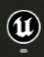
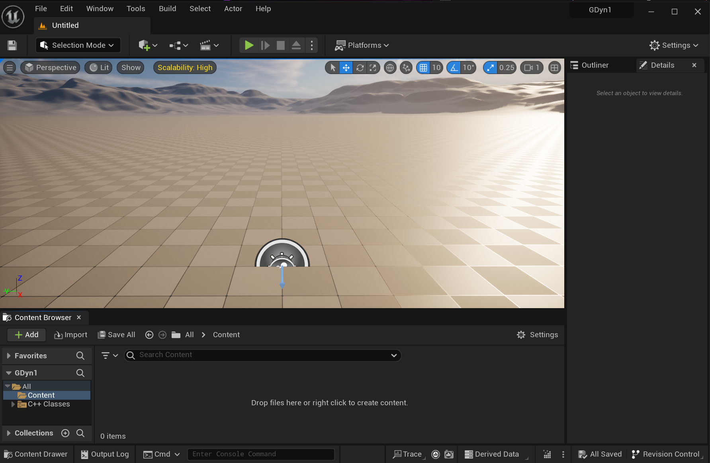
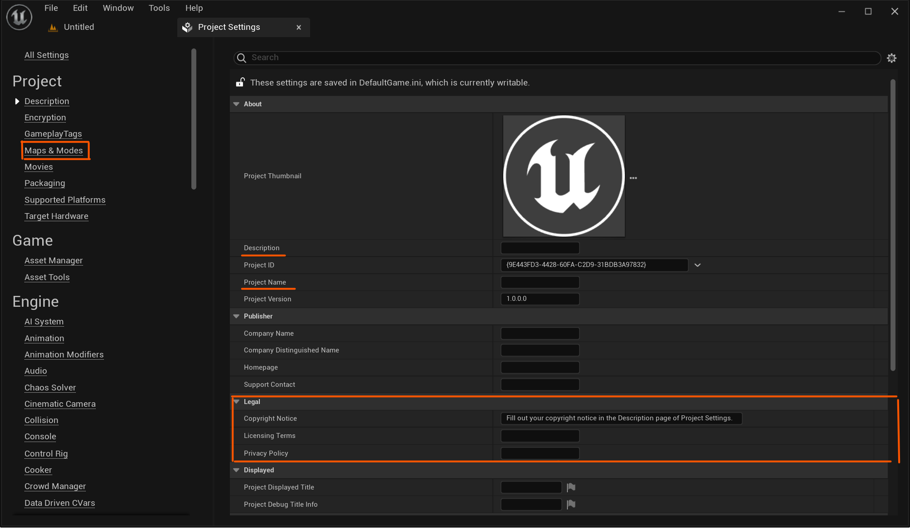
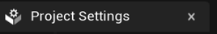
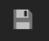
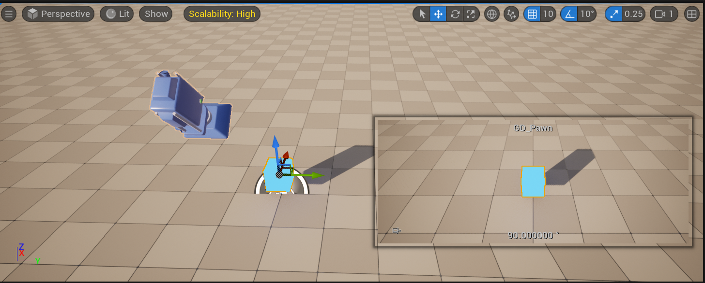
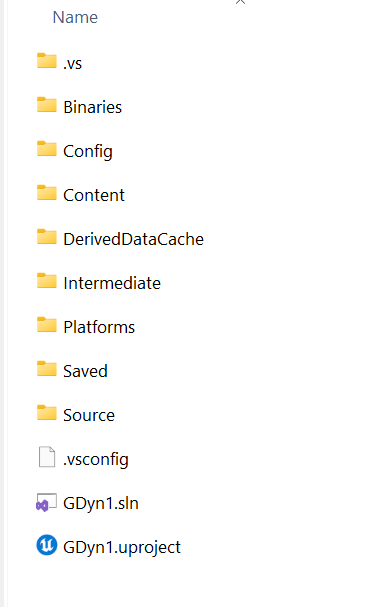

import Template from './img/unreal_proj_browser.png';
import TemplateType from './img/unreal_template_type.png';
import ProjectLang from './img/unreal_pick_baselang.png';
import CreateProj from './img/unreal_fileloc.png';
import CreateCPP from './img/create_cpp_class.png';
import ProjectFolderStructure from './img/vs_project.png';
import BuildSuccess from './img/build_success.png';
import PawnScene from './img/pawn_actor_scene.png';
import Outliner from './img/outliner.png';
import StaticMesh from './img/staticmesh.png';
import EnhancedInput from './img/enhanced_input.png';
import InputAssets from './img/input_assets.png';
import InputActions from './img/input_actions.png';
import IMC1 from './img/imc_1.png';
import IMC2 from './img/imc_2.png';
import IMC3 from './img/imc_3.png';
import IMC4 from './img/imc_4.png';
import IMC_Assign from './img/assign_input_content.png';

# Week 1 - Introduction to UE5


:::info

Task Sheet 1 - Getting Started with UE5

:::


### Introduction
The Unreal Engine is a powerful software tool, allowing for the creation of many types of games, from small **indie** tiles to **AAA (triple A)** masterpieces. We'll be using UE5.

### Using Unreal Engine 5 and C++
When creating 3D games, you will frequently need to include **physics** to provide realistic object movement and other physical simulation. **Physics Engines** are often used within the games industry to provide realism within game environments. The Unreal Engine 5, (UE5)  is used widely within the games industry, and has the physics engine **PhysX** built into it. The worksheet introduces game development using UE5 with C++.


## Create C++ Project

### 1. Open UE5 version 5.2.1

Open UE5 with **UE5 Editor**, using the desktop icon . 

At home you will likely use the **Epic Games Launcher**, but in the university the icon is the only way to launch UE5 successfully.

### 2. Project Template Selection

**Select** the **Games** option, as shown below.


### 3. Select the Project Template Type

Select the Blank option. 


### 4. Pick Project Language

Change Blueprint to C++, as shown below. Make sure that the Starter Content pack is set to **No Starter Content** as also shown below.


### 5. Create Project

Within **Project Location**, type in **C:\\temp\\UE5\\** and within **Project Name** type in **GDyn1**, as per the screen below.


After that, click on the **Create** project button.

The **UE5 editor** should load, along with **Visual Studio**.  The UE5 editor should look something like the below:



Now press the **Play**, , button to run the program. 

A platform, with hills and skybox is shown. Use your mouse to change the camera viewpoint within the output Window. You can also use **WSDA** and **QE** keys on the keyboard to move around the scene. Note: press **Escape** to exit.


:::note

Now the project exists, let's familiarize ourselves with the editor and configure it.

:::


## Exploring and Configuring the Editor

### Initial UE5 Setup

Before continuing with the project, it would be useful to setup the initial project's settings.

Do the following:

1. Click on menu **Edit** option and then the **Project Settings** option. A Project Settings window should be displayed.



2. It is worth putting your **name** within the **Copyright Notice** text box, in the Legal section, as it is added at the top of C++ files added during development. You may also want to add a **Description** and **Project name**, but it is up to you.

3. **Close** the Project Settings window, using the 
. 

Initially, your project should have a `map/level` associated with it. At this stage it is worth adding a map. Do the following:

4. Within the **Content Browser** panel, you can toggle using the keyboard short cut `Ctrl-Spacebar` to open. **Right-click** over the **Content** folder and within the context menu, select **New Folder** and change **NewFolder** to **Maps**.

5. Click on menu option **File** and then the **Save Current Level As...** option.

6. Change **NewMap** to **GDMap** and then **click** on the **Maps** folder, and then click the **Save** button.

7. Click on menu option **Edit** and then the **Project Settings** option, and then the **Maps & Modes** option located on the left sidebar as shown in the image of the project settings.

8. Change both `default` values for **Edit Startup Map** and **Game Default Map** to **GDMap**, either using the drop down or by selecting the map in the content browser and clicking on the left-pointing arrow.

9. Close the Project settings window.

10. Within the UE5 Editor, **save** using the  icon.

Now your project should save to the **GDMap** and also on reloading, startup on the **GDMap** instead of generic or untitled map.


## Adding first C++ script

1. Within the Editor click on **Tools**, click on **New C++ Class...**. An **Add c++ Class** form should be displayed. We want to add an object that can respond to inputs.

<div class="image-container">

</div>

2. Select **Pawn** and click on the **Next** button. Within the **Name** text box, type in **GD_Pawn** and then click on the **Create Class** button.

3. A class should be added to the Project under **C++ Classes/GDyn1** folder, which should be compiled within the UE5 editor, as it is added. The default code for the **GD_Pawn** class should be open in VS. Head there now. You may be prompted to **Reload All**, click on it, if requested.

4. Before continuing, it may be worth reviewing and changing the settings for VS, as suggested [<u>Here</u>](https://docs.unrealengine.com/5.2/en-US/setting-up-visual-studio-development-environment-for-cplusplus-projects-in-unreal-engine/)

5. Within the **Solution Explorer** pane, click on the **arrow** by the project name **GDyn1** and then the **arrow** by **Source** and then the **arrow** next to **GDyn1**. The header and source file, for the <u>GD_Pawn</u> class should be shown, similar to the screenshot below.


<div class="image-container">
  
</div>

6. Click on the **GD_Pawn.h** header file, if it's already open.

#### Pawn class is an Actor

In UE5, objects that can be placed within a game environment often have common features and functionality associated with them, such as their location. UE5 have created an Actor class that include common attributes / functions for game objects. As such, most objects, that appear within a game, in UE5, inherit from an Actor class.

The naming convention used in UE5, is for Actors, directly created, or inherited from, have their class names prefixed with an **A**. A Pawn object inherits from an Actor, so you will note that the class name for our Pawn object is not **GD_Pawn**, but **AGD_Pawn**. Thus, we can identify an Actor-based class, by the A that prefixes it!


```cpp title="C:\temp\UE5\GDyn1\Source\GDyn1\GD_Pawn.h"
// Fill out your copyright notice in the Description page of Project Settings.

#pragma once

#include "CoreMinimal.h"
#include "GameFramework/Pawn.h"
#include "GD_Pawn.generated.h"

UCLASS()
class GDYN1_API AGD_Pawn : public APawn
{
	GENERATED_BODY()

public:
	// Sets default values for this pawn's properties
	AGD_Pawn();

protected:
	// Called when the game starts or when spawned
	virtual void BeginPlay() override;

public:	
	// Called every frame
	virtual void Tick(float DeltaTime) override;

	// Called to bind functionality to input
	virtual void SetupPlayerInputComponent(class UInputComponent* PlayerInputComponent) override;

};

```

:::note

Next, we'll look at components.

:::


## Scene Components

### Adding Components to the Pawn

We want to add functionality for the class to handle inputs and create components, so that the object can be displayed and a camera can also be setup to follow the object. For the object to be displayed during the game play, we need components to be added to it. Do the following:

1. Within **GD_Pawn.h**, add the following code below, after the **public:** keyword:

```cpp title="C:\temp\UE5\GDyn1\Source\GDyn1\GD_Pawn.h"
UPROPERTY(EditAnywhere)
USceneComponent   *VisibleComponent;

UCameraComponent  *Camera;
```

2. Just before the include `GP_Pawn.generated.h` line, add:

```cpp title="C:\temp\UE5\GDyn1\Source\GDyn1\GD_Pawn.h"
#include "Camera/CameraComponent.h"
```

:::info

Note:  In UE5, within a header file, the ..generated.h include line should always be the last include, else UE5 will not function correctly.

:::


A `USceneComponent` contains a transform, where the position, rotation, and scale of a component are stored. In addition, a camera component has been added too.

We now want to create a root component that we can attach a camera to. Do the following:

3. Firstly, we want to specify that this object will receive input during game play. Within the **GD_Pawn.cpp** source file, in the **constructor** add the following code:

```cpp title="C:\temp\UE5\GDyn1\Source\GDyn1\GD_Pawn.cpp"
// Sets default values
AGD_Pawn::AGD_Pawn()
{
 	// ...

	// Set this pawn to be controlled by the lowest-numbered player
	AutoPossessPlayer = EAutoReceiveInput::Player0;
}
```

4. Now let's create the components we declared. Within the **GD_Pawn** constructor again dd the code:

```cpp title="C:\temp\UE5\GDyn1\Source\GDyn1\GD_Pawn.cpp"

// Sets default values
AGD_Pawn::AGD_Pawn()
{
 	// ..

	// Create a dummy root component we can attach things to.
	RootComponent = CreateDefaultSubobject<USceneComponent>(TEXT("RootComponent"));

	// Create a camera and a visible object
	Camera = CreateDefaultSubobject<UCameraComponent>(TEXT("camera"));
	VisibleComponent = CreateDefaultSubobject<UStaticMeshComponent>(TEXT("visibleComponent"));

	// Attach camera & visible object to root component. Offset & rotate camera.
	Camera->SetupAttachment(RootComponent);
	Camera->SetRelativeLocation(FVector(-250.0f, 0.0f, 250.0f));
	Camera->SetRelativeRotation(FRotator(-45.0f, 0.0f, 0.0f));
	VisibleComponent->SetupAttachment(RootComponent);
}

```

5. Build the cpp file by clicking on **Build**, **Build Solution** (or Ctrl Shift B).

If successful, you should get a message in the Output panel, similar to:


<div class="image-container">
  
</div>


6. Return to the **UE5 editor**, and click on the **Compile** button, and **drag** the **GD_Pawn** icon, from the **Content Browser**, to the **Viewport** panel. Once added, your viewport should look similar to below:

<div class="image-container">
  
</div>


:::note

Note: the camera and object's coordinate position may be in a different position, and may not be visible, depending on where you dragged the icon.

:::


Within the **World Outliner** panel, typically on the top and right-hand side, you should note that an object **GD_Pawn** is now listed. Within the **Details** panel, on the right-hand side, you should notice that an object has been named **GP_Pawn** and that a **RootComponent** has a **visibleComponent** as its component. As you can see in the following screenshot.


<div class="image-container">
  
</div>

Importantly, a **Transform** panel displays an object's position (Location), its rotation and its current scale values.

7. Amend the **Location** of the **Transform** of **GD_Pawn (instance)** to `x=0, y=0, z=50`. These figures place the object approximately in the middle of the platform, and the camera looking towards the center. Click on **Play** and try to move around to try and change the game's viewport.

You should notice that the viewport is in the middle of the platform and that the GD_Pawn object is not yet visible.


:::info

Note how the camera isn't visible in the details panel at all. At present, the camera's position and rotation, relative to the player, can only be specified in code. If you did want to change the camera's Transform values in the editor for example, you would need to add the <u>UPROPERTY</u> macro within the respective header file. You can view the various tags you can add inside UPROPERTY by highlighting it in the C++ code and pressing F12, then scrolling to the appropriate enum. They should include <u>EditAnywhere</u>, <u>VisibleAnywhere</u>, <u>BlueprintReadOnly</u> and <u>BlueprintReadWrite</u> and many more.

It should also be noted that in UE5, objects can be updated each frame via a Tick() function (unless you switch it off).

:::

:::note

We now want to view the GD_Pawn object. We are going to add a visible static mesh.

:::

### Viewing and Moving the Input Object

1. Within the **Details** panel, select the **visibleComponent**, as show below.


<div class="image-container">
  
</div>

2. Within the **Static Mesh** panel, click on the **arrow** with **None** shown.

3. Click on **View Options** and click on **Show Engine Content**.

4. Select **Cube** (highlight and look for approx. size 100x100x100) as the static mesh option.

5. Within the **Materials** panel, change **WorldGridMaterial** to **WidgetMaterial_X** or similar.

6. Save the Map using the **Save Current** icon .

If you look at the viewport now, the GD_Pawn object is now visible with the selected static mesh and material.


#### Exercise
The static mesh is quite large. In UE5, click on the **visibleComponent** in the **GD_Pawn** object and **Scale** it to **0.5** in all directions. Reset the Z location accordingly.


For reference, you should have something similar looking to the following by now:



:::note

Next, we will look at receiving Input.

:::

## Input Management

### Configuring Input

In UE5, we can configure how to respond to input events, such as key presses, or mouse button / controller actions, either in code, or via the editor. We will use the editor to simplify the process.

:::info

UE5 have deprecated the old way to do input as in input actions and input axis and have made a new system called **Enhanced Input** that has Input Actions and Input Mapping Contexts to setup. This new method is more work to setup than the old method but does provide more control and functionality compared to the old system. Once it is setup you will have more freedom and more options but there is some ground work to lay. You can read more about [<u>Enhanced Input</u>](https://docs.unrealengine.com/5.0/en-US/enhanced-input-in-unreal-engine/).
:::

1. First we must ensure that you are using Enhanced Input, go to the **Edit** dropdown menu and choose **Project Settings**. From there, locate the **Input** section (under the **Engine** heading) and find the **Default Classes** settings. Ensure the settings are set to **EnhancedPlayerInput** and **EnhancedInputComponent**, respectively.

<div class="image-container">

</div>


#### Core Concepts

There are few core concepts you need to understand to start utilizing the Enhanced Input system effectively.

The Enhanced Input system consists of four main concepts:

1. **Input Actions**: These are the communication links between the Enhanced Input system and your project's code. They represent character interactions or user input states, such as jumping, opening doors, or changing a character's movement. Input Actions are distinct from raw input and can report values on up to three floating-point axes.

   - Example: "pick up item" Action only needs an on/off state, while "walk" Action requires two axes for direction and speed.

2. **Input Mapping Contexts**: These map user inputs to Input Actions and can be dynamically added, removed, or prioritized for each user. Contexts can be applied to local players through the Enhanced Input Local Player Subsystem. Prioritization resolves collisions between multiple Actions consuming the same input.

   - Example: Adding "open door" Context when the character is near a door, and adding a "select item" Context that out-prioritizes "open door" when the character opens a backpack. Removing "select item" Context when the backpack is closed, enabling the "open door" Context to take effect.

3. **Modifiers**: Modifiers adjust raw input values from user devices. Each Input Mapping Context can have multiple modifiers associated with raw input for an Input Action. Common Modifiers include dead zones, input smoothing, and conversion of input vectors from local to world space. Developers can also create custom Modifiers.

4. **Triggers**: Triggers use post-Modifier input values or output magnitudes of other Input Actions to determine if an Input Action should activate. Each Input Action within an Input Mapping Context can have one or more Triggers for each input.

By combining these concepts, developers can easily set up input systems, ranging from simple to complex, without requiring changes to project code. This enables flexible and efficient handling of user inputs based on the character's situation, without the need for input-handling code to be aware of specific game systems like doors and backpacks.

2. Now go back to Visual Studio, and find the **GDyn1.Build.cs** c-sharp file. Now add <u>"EnhancedInput"</u> to the **PublicDependencyModuleNames** as follows.

```cpp

PublicDependencyModuleNames.AddRange(new string[] { 
  "Core",
  "CoreUObject",
  "Engine",
  "InputCore",
  "EnhancedInput" });

```

3. Next we going to setup the **Input Mapping Context**. Open **GD_Pawn.h**  under the protected access specifier you need to add a pointer to **UInputMappingContext** and ensure its set to be **EditAnywhere** and we can also add a category so that it will show in the **Details** panel of this Pawn Actor class. 

```cpp title="C:\temp\UE5\GDyn1\Source\GDyn1\GD_Pawn.h"
protected:
	// Called when the game starts or when spawned
	virtual void BeginPlay() override;

	UPROPERTY(EditAnywhere, Category = "Enhanced Input")
	class UInputMappingContext *InputMappingContext;
```

Now that we have the pointer to the input mapping context, it needs to be added to the engine's **Subsystem** for the **LocalPlayer** to use. **Remove** all the code inside **SetupPlayerInputComponent** method, and replace them with the following code. Don't forget to add the necessary header files in the **GD_Pawn.cpp** source file.

```cpp title="C:\temp\UE5\GDyn1\Source\GDyn1\GD_Pawn.cpp"
#include "GD_Pawn.h"
#include "InputMappingContext.h"
#include "EnhancedInputSubsystems.h"

//...

// Called to bind functionality to input
void AGD_Pawn::SetupPlayerInputComponent(UInputComponent* PlayerInputComponent)
{
	// Get the player controller
	APlayerController* PC = Cast<APlayerController>(GetController());

	// Get the local player subsystem
	auto* Subsystem = ULocalPlayer::GetSubsystem<UEnhancedInputLocalPlayerSubsystem>(PC->GetLocalPlayer());

	//  Clear out existing mapping, and add our mapping 
	Subsystem->ClearAllMappings();
	Subsystem->AddMappingContext(InputMappingContext, 0);
}
```

Compile the code, for now, to ensure there are no unexpected errors that pop up.

4. Now its time to add the **InputAction**. This is similar to the **ActionBinding** found in the old input system, but instead of creating them in the **Project Settings**, the new system has the **Action** created as an object in the project folder, that can be modified at runtime. Open **GD_Pawn.h** header file and under the protected access modifier, just under the InputMappingContext variable that we created. Add the following pointer variables. Also ensure to include **InputAction.h** header file just before the **.generated.h** header file.

```cpp title="C:\temp\UE5\GDyn1\Source\GDyn1\GD_Pawn.h"
  // ...
  #include "InputAction.h"
  #include "GD_Pawn.generated.h"

// ...

protected:
  
  // ...

	UPROPERTY(EditAnywhere, Category = "Enhanced Input")
	UInputAction* InputMove;

	UPROPERTY(EditAnywhere, Category = "Enhanced Input")
	UInputAction* InputRotate;

	UPROPERTY(EditAnywhere, Category = "Enhanced Input")
	UInputAction* InputGrow;

// ...
```


### Responding to Key Inputs

Firstly, we are going to create 3 functions that will respond to key presses and then bind them to the input we setup earlier.

1. Within VS, **add** the following functions to the **GD_Pawn.h** file (you don't need to add the body yet, just create stubs or function prototype/signature):

```cpp title="C:\temp\UE5\GDyn1\Source\GDyn1\GD_Pawn.h"
	void Move   (const FInputActionValue  &Value);
	void Rotate (const FInputActionValue  &Value);
	void Grow   (const FInputActionValue  &Value);
```

2. Also add the following member variables:

```cpp title="C:\temp\UE5\GDyn1\Source\GDyn1\GD_Pawn.h"

	UPROPERTY(EditAnywhere)
	FVector CurrentVelocity = FVector(100.0f, 100.0f, 0.0f);

	UPROPERTY(EditAnywhere)
	float Angle = 45.0f;

	bool bShouldGrow;
```

3. Within the **GD_Pawn.cpp**, make the functions do the following:

<ol type="a">
  <li> <strong>Rotate (...)</strong> should rotate the pawn.</li>
  <li> <strong>Move (...)</strong> should move the cube based on the WSAD keys.</li>
  <li> <strong>Grow (...)</strong> should only read and set the <strong>bShouldGrow</strong> to true or false based on the input.</li>
</ol>

Note: the **Tick(...)** method should be responsible for implementing the grow and shrinking behavior of the cube. 

4. Now open **GD_Pawn.cpp** source file and add the following code right before the code to setup the input mapping context. Also make sure to include **EnhancedInput/Public/EnhancedInputComponent.h** header file in the .cpp file.


```cpp title="C:\temp\UE5\GDyn1\Source\GDyn1\GD_Pawn.cpp"
#include "GD_Pawn.h"
#include "InputMappingContext.h"
#include "EnhancedInputSubsystems.h"
#include "EnhancedInput/Public/EnhancedInputComponent.h"

//...

// Called to bind functionality to input
void AGD_Pawn::SetupPlayerInputComponent(UInputComponent* PlayerInputComponent)
{
	// Get the EnhancedInputComponent
	UEnhancedInputComponent* PEI = Cast<UEnhancedInputComponent>(PlayerInputComponent);
	if (!PEI)
	{
		UE_LOG(LogTemp, Error, TEXT("EnhancedInputComponent not found!"));
		return;
	}

	// Bind the actions
	PEI->BindAction(InputMove	, ETriggerEvent::Triggered, this, &AGD_Pawn::Move);
	PEI->BindAction(InputRotate	, ETriggerEvent::Triggered, this, &AGD_Pawn::Rotate);
	PEI->BindAction(InputGrow	, ETriggerEvent::Triggered, this, &AGD_Pawn::Grow);

	// Get the player controller
	APlayerController* PC = Cast<APlayerController>(GetController());

	// Get the local player subsystem
	auto* Subsystem = ULocalPlayer::GetSubsystem<UEnhancedInputLocalPlayerSubsystem>(PC->GetLocalPlayer());

	//  Clear out existing mapping, and add our mapping 
	Subsystem->ClearAllMappings();
	Subsystem->AddMappingContext(InputMappingContext, 0);
}
```

5. Open back the UE5 Editor and open the **Content Browser** under **Content** folder, create a new folder call it **Input** by right-clicking and selecting New Folder. Inside this folder we are going to create the Input Actions and the Input Mapping Context for our project. You should have something like the following:

<div class="image-container">

</div>

For the **Input Actions** assets, you should have the following settings.

<div class="image-container">

</div>

- The Value type setup as **Axis2D (Vector2D)** for **IA_Move** 
- The Value type setup as **Axis1D (float)** for **IA_Rotate**
- The Value type setup as **Digital (bool)** for **IA_Grow**

Also don't forget to tick the **Consume Input** option.

Next is the **Mapping Context**. Create the object and map the actions with appropriate keybinds. Here is the set and which modifiers to use for **WASD** (movement), **R** key for rotation and **spaceBar** key for (grow/shrink).

To setup the Mapping Context, you need to create and initialize as the following:

1. Create the initial mapping
<div class="image-container">

</div>

2. Assign the keys
<div class="image-container">

</div>

3. Assign the **Modifiers**
<div class="image-container">

</div>

<div class="image-container">

</div>

4. The final step is to assign the assets you created for the **Input Actions** and **Input Mapping Context** to the Pawn script pointer variables we created in **GD_Pawn.h**. 

<div class="image-container">

</div>


## Expected Results

The behaviour of your program given that we have created our **Pawn** actor and given it the **camera** and **static** mesh components, and we have configured enhanced input system. Now you have to finish the three defined behaviours of the cube. 

-  **Growing**: If the pawn should be growing, increase the scale by delta time every tick inside the **Tick(...)** method. If it isn't growing then reduce the scale by delta time / 2 each tick. The scale should not exceed 2 or go below 0.5.

  The following **functions** will help.

  ```c++
  FMath::Clamp (...)
  VisibleComponent->GetComponentScale (...)
  VisibleComponent->SetWorldScale3D (...)
  ```

- **Moving**: If the current velocity is not equal to zero, create a new location by adding the velocity multiplied by delta time to the old position and set the location to be the new **FVector**.

  The following **functions** will help.

  ```c++
  GetActorLocation (...)
  SetActorLocation (...)
  CurrentVelocity.IsZero (...)
  ```

- Rotating: If the value of **Angle** is not equal to 0, get the current rotation of the actor and add to it's **yaw** value the value of **Angle**.

  The following **functions** will help.

  ```c++
  GetActorRotation (...)
  SetActorRotation (...)
  ```

  The type **FRotator** will also be used. It has the Yaw component.


:::tip


Note: Inside any of the three methods we defined **Rotate(...)**, **Move(...)** or **Grow(...)** you can use `GetWorld()->DeltaTimeSeconds` to get the time in seconds as the delta time. Otherwise you can use the **Tick(...)** which has the delta time passed into the function.


:::


1. Within the UE5 Editor, **Compile** the program, using the icon.
2. **Play** the game and use the **WASD** and **R** keys to move and rotate the object and then press the spacebar to scale the object.
3. **Save** the level using the **Save Current** icon.


:::info

Note  how a function is created for each action. We then 'bind' / associate the respective functions with the key mappings we setup. 

Note how, for example, a position is stored as a **FVector** in UE5, and how a rotation is stored with a **FRotator**. Note also how a **Clamp(...)** function can be used to restrict values, within a range. Also, note how the current Actor / Pawn  object's location, scale and rotation 'transform' values can be found using the respective 'get' functions, and how they can be reset using the respective 'set' functions.

You'll also notice if you rotate then when you try to move forwards then you will not move as expected. To fix this we'll need to move relative to the character's "forwards" vector.

:::


<div class="image-container">


</div>

## Reducing Project File Size

In UE5 C++ development, we compile / build code using VS2022 and UE5, which creates a number of _temporary_ folders that do NOT need to be stored once development has been completed.

:::note

The _temporary_ folders are re-created when UE5/VS2022 loads and builds the core files / folders of an UE5 project.

:::

Close down VS2022 and UE5, and in **File Explorer**, go to **GDyn1** project's folder, where the **.uproject** file is, and you should note the following folder / files:


<div class="image-container">



</div>

If you review the size of the project, it will probably be in GB!

You can safely **delete** the following folders : **.vs** and **Binaries** and **Intermediate** and **Saved** to reduce file storage!

If you review the size of the project after deleting the above folders, it will probably be in low MB!

## Bonus Tasks


1.  In the UE5 editor, add an additional input for rotation, such that on a **T** key  press the cube object rotates in the opposite direction.

2. Add a new input that when pressed toggles between "run" and "walk". When walking, halve the player speed. Do not change the const variable to achieve this.

3. Fix the issue where the movement doesn't rotate with the object. You will need the **GetActorForwardsVector** and **GetActorRightVector** functions to achieve this.