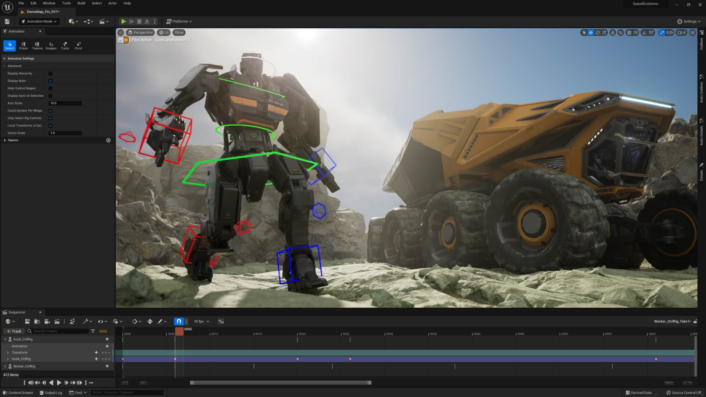

# Module Info

module info: http://modules.bolton.ac.uk/modules/GAP5006/Academicyear/2019-20

## Description
This module will introduce you to **basic laws of physics** that describe <u>motions</u> and <u>collisions</u> and to demonstrate how they are used to produce believable content in computer games. You will be given the theoretical underpinning knowledge to understand how objects within a 2D and 3D game can be realistically modelled using physics concepts and equations. The basic mechanical principles of **straight line, circular and simple harmonic motion** will be taught to you and you will apply your knowledge to relevant problems. In addition, you will learn about **forces on particles and rigid body dynamics** and how it applies within games development in 2D and 3D. You will produce a computerized simulation, or game, that uses physics to model physical situations in a realistic manner. The following Game attributes are developed in this module: Problem Solver, Confident Lifelong learning.

### Indicative Content
- Vectors: 2D and 3D vectors; resolution of vectors; vector addition and subtraction; using the vector dot product and cross product
- Straight line, circular and simple harmonitc motion
- Modelling Projectiles
- Newton's laws of motion; resultant forces; friction forces and forces on inclines 
- Rigid body dynamics; moments; couples and torques
- Moment of inertia for standard shapes
- Collision response; elastic, inelastic and partially elastic collisions
- Applying phyiscs within a simulation environment, and / or, game engine.

### Learning Outcomes
On successful completiion of this Module you will be able to:
1. Apply physics withi a game program and / or simulation.
2. Compare and contrast physics-based concepts / techniques
3. Use laws of physics to effectively analyse and solve problems
4. Appraise athe applicability of particle and non-particle physics

