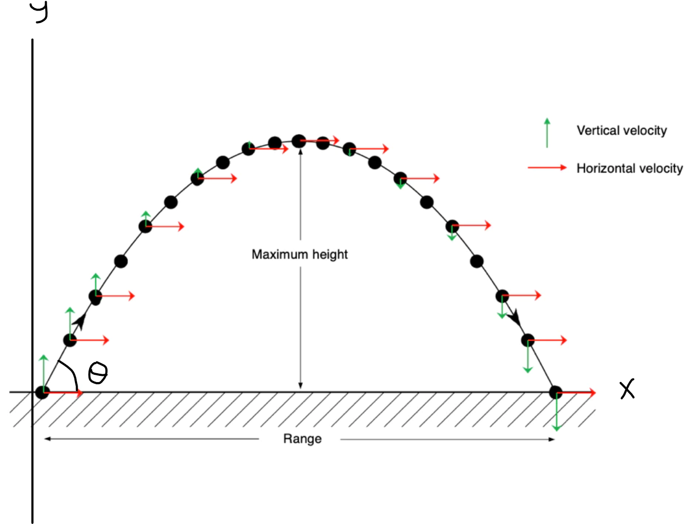

# Week 1 - Straight Line Motion

## Introduction

As outlined by **(Eberly, 2010)**, a significant aspect of modern game development is the physically realistic movement of objects within a game. Correctly using the laws of physics can greatly enhance the realistic movement of objects within games.

As stated by **(Bourg & Bywalec, 2013, p.23)**: "_...kinematics is the study of the motion of bodies without regards to the forces on the body_." At this point, we are thus interested in <u>kinematics</u>. The most straightforward technique for modelling object movement is where straight line motion is assumed to take place, as outlined below.

## Definitions

The most fundamental units required to deal with motion are **distance** and **time**. Distance and time can be measured in many different ways, such as: miles and hours, yards and minutes, meters and seconds, respectively. In Physics, we tend to use **Standard Systeme International, (SI)** units, which for distance and time are meters and seconds, respectively, though as **(Bourg & Bywalec, 2013)** outline, it is _consistency_ that matters when using units in physics.

### Speed

To represent moving objects, the distance traveled over a particular time indicates how `fast` a motion is. This value of <u>distance divided by time</u> is called **speed**. It should be notated that speed is a so-called **scalar quantity**, i.e. it has size, or magnitude, but <u>no direction</u>. Typical values of speed are: 47 miles per hour, or, 3.7 meters per second.

The formulas for distance, time, and **speed** are given by, all can be derived from the formula fo speed:

$$
\text{distance} = \text{speed} \times \text{time}
$$

$$
\text{time} = \frac{\text{distance}}{\text{speed}}
$$

$$
\mathbf{speed} = \frac{\text{distance}}{\text{time}}
$$

### Velocity

Often, particularly in game development, the direction of travel is important. If the speed of an object is also given <u>with its direction</u>, then it's called a **velocity**. Velocity is said to be a <u>vector quantity</u>, i.e. it has magnitude and a direction. Typical velocity values are: 35 miles per hour due east, or,  4.6 meters per second at 45* to the x-axis.

In Physics, we often represent related characteristics such as distance, time and velocity as an equation. So, velocity is often written as:

$$
\mathbf{v} = \frac{\text{s}}{\text{t}}
$$

Where **v** = velocity (the average velocity), **s** = distance traveled in a particular direction also referred to as **displacement** as the overall change in position of an object, and finally **t** = time taken.

It is important that <u>units of measurement are consistent</u> throughout. So, if displacement is in meters and time is in seconds, then velocity is in meters per second, **m/s**.

### Acceleration

If the velocity of an object changes over time, for example, where the brake of a car is pressed to reduce a car's velocity, then this needs to be accounted for. A change in velocity over a period of time is given the name acceleration - or sometimes deceleration if velocity is reduced.

For straight line motion, under <u>constant</u> acceleration, an equation of motion could be written as:

$$
\mathbf{a} = \frac{\text{v} - \text{u}}{\text{t}}
$$

where **v** = final velocity and **u** = initial velocity. As before, units of measurement are important. So, change in velocity could be given by m/s and t will be in seconds, acceleration, a, will be in 

$$ \frac{\text{m}}{\text{s}^2}
$$

:::note

## Example 1

Rearrange the acceleration equation above so that  that the final velocity **v**, can be calculated.

A car, traveling at 15 m/s due north, accelerates due north by 1.5 meters per seconds squared $m / s^2$, for 3 seconds. What is the car's final velocity?

:::

:::note

## Exercise 1

A car, initially, at rest, accelerates to 6 m/s due south in 3 seconds, and then continues at that velocity for 5 seconds. How far does the car travel? Draw a velocity-time graph and calculate the distance for each 'stage' of the journey.

:::

## Equations of Motion

:::info

Equations of motion for <u>constant</u> linear acceleration

:::

1. Average velocity

$$
v_{\text{avg}} = \frac{u + v}{2}
$$

2. Average velocity using displacement and time

$$
v_{\text{avg}} = \frac{s}{t}
$$

3. Final velocity with constant acceleration

$$
v = u + at
$$

4. Displacement with constant acceleration

$$
s = ut + \frac{1}{2}at^2
$$

5. Final velocity squared with constant acceleration

$$
v^2 = u^2 + 2as
$$

:::note

## Exercise 2

Calculate the distance traveled during acceleration, from its initial position, for the car in Example 1.
:::

### Acceleration due to gravity

As mentioned previously, velocity requires a magnitude and direction. For example, when an object is moving vertically upwards, then this may be viewed as a positive value, whereas when an object iss moving downwards, then it is in the opposite direction to upward, so it should be negative. Note: if you decide that upward is negative and downward is positive, it should make no difference to the motion equations!

**Galileo** found that when an object is free to move vertically, then gravity - which is an <u>acceleration</u> will accelerate the object vertically downwards, <u>regardless of its mass</u>, as outlined by (Fowler, 1996). Near sea level, gravity, **g**, is approximately 9.8 $m / s^2$.

Note: <u>all</u> objects are accelerated by gravity, but for some objects they will not be accelerated as much as others because their <u>air resistance</u> is high, such as for a feather. If a feather was placed in a vacuum, however, it would fall to the ground at the same velocity as any other object!

If we <u>ignore</u> air resistance, we can use the equations of motion stated previously.

:::note

## Example 2

If a ball is thrown vertically upwards with an initial velocity of 5 m/s at a height of 2m from the ground, what would be the maximum height of the ball from the ground?  How long would it take for the ball to hit the ground?

:::

:::note

## Exercise 3

An object is released from a height of 5m from the ground.  How long would it take to reach the ground and at what velocity would it be moving just before reaching the ground?

:::

## Projectiles

A projectile is an object placed in motion, with an initial force, but with no further propulsive force acting to move the projectile.  As such, a projectile’s path is mainly affected by its initial velocity – magnitude and direction – and then by acceleration due to gravity.  In reality, other forces, such as drag, will influence a projectile’s motion, but for small projectiles over relatively small distances, the equations of motion are reasonably accurate.

A typical projectile path follows a parabolic shape as shown in Fig. 1 below.

_Figure 1 - Idealized projectile path assuming no resistance forces_

Where **$\theta$** is the intial launch angle.

A number of features should be noted. Firstly, acceleration due to gravity only affects the <u>vertical</u> direction, i.e. y direction. Gravity does <u>not</u> affect the horizontal component, or x direction. It is assumed that there is <u>no</u> force stopping movement in the horizontal direction. Secondly, we assume a <u>symmetric</u> projectile path.

:::tip

What will be the vertical velocity when the projectile reaches its maximum height ?

So, to tackle such problems we use the equations of motion studied previously, but we use the equations <u>separately</u> for the x and y directions.
:::

:::note

## Example 3

A missile is launched at an angle of 35º to the ground, with an initial speed of 100 m/s.  What would the maximum height of the missile be, and how far, horizontally, would the missile travel before hitting the ground?

:::

:::note

## Exercise 4

An object is thrown at an angle of 15º to the ground at 20 m/s.  How long would it take for the object to hit the ground and how far will it have travelled horizontally?

:::

## Bibliography

- Bourg, D. M., & Bywalec, B. (2013). Physics for Game Developers : Science, math and code for realistic effects (2nd ed.). California: O'Reilly.
- Eberly, D. H. (2010). Game Physics (2nd ed.). US: Morgan Kaufmann.
- Fowler, M. (1996). Galileo’s Acceleration Experiment. Retrieved January 19, 2022, from http://galileoandeinstein.physics.virginia.edu/lectures/gal_accn96.htm

